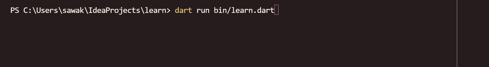
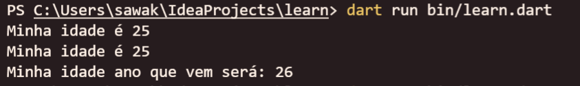
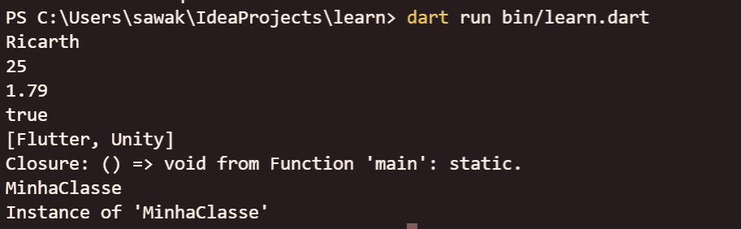
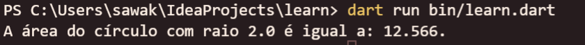

# Entrada e Saída de Dados no Terminal do Dart

> `https://www.alura.com.br/artigos/entrada-saida-dados-terminal-dart`

## Resumão

Esse artigo é para você que está começando a programar com Dart! Nele vamos nos aprofundar em como ler uma informação do teclado e mostrá-la na tela usando o Terminal de Dart.

Esse artigo está dividido nos seguintes passos:

- A importância de “conversar” com o computador;
- Saída de dados com a função Print;
- Entrada de dados com a Biblioteca `dart:io`.

Aprender a usar essas ferramentas vai ajudar você bastante no processo de aprendizado da linguagem Dart! Vamos lá?

## Importância de “conversar” com o computador

Quando tratamos de Programação, é comum imaginar que queremos trocar dados com o computador para resolvermos nossos problemas, certo? Essa troca de dados, quando ocorre diretamente, muitas vezes é chamada Entrada/Saída (ou mais conhecida como I/O, do inglês, Input/Output).



Quando programamos em Dart, usamos principalmente o terminal para ler as informações que a ferramenta nos entrega (como dados, erros e avisos) e o resultado das operações que estamos realizando.

## Saída de dados com a função Print

Um dos primeiros contatos que temos com Dart é a função print(). Usamos essa função para mostrar algo no terminal do Dart. No começo, costumamos usá-la para imprimir (ou seja, mostrar no terminal) textos simples, mas ela pode ser muito mais poderosa que isso.

Vamos descobrir mais sobre isso?

## Imprimindo código externo em uma String

Essa primeira dica, na verdade, funciona em qualquer String (pois é uma propriedade do objeto String), mas o local onde mais vamos usar essa propriedade é justamente em uma String que estará dentro de um print().

Para concatenar (juntar) informações textuais com dados armazenados nas nossas variáveis, podemos interpolar essas variáveis, e até expressões, com nossa String usando o caractere $. Observe o código e veja se está claro para você o que acontece:

```dart
void main() {
  int idade = 25;

  print("Minha idade é " + idade.toString()); // Tem que converter manualmente para concatenar, mais trabalhoso, menos legível.
  print("Minha idade é $idade"); // Adicionado por interpolação.
  print("Minha idade ano que vem será: ${idade + 1}"); // Uma expressão!
}
```

Se observamos bem o código, veremos que ele todo está ainda na “fase” de entrada. Primeiro, é criada uma variável int chamada idade e com valor de 25. Depois, usando a função print, criamos uma frase que chama a variável int criada anteriormente. Tudo que vem depois da função print será imprimido no terminal, na etapa de saída.

Saída:



## Imprimindo outros tipos de objetos

A função print() consegue mostrar algo na tela para todo tipo de objeto em Dart. Para isso, ela usa o método toString(), que é herdado da classe Object, que é como se fosse o “molde” de todos os outros objetos!

Isso quer dizer que você pode imprimir Inteiros, Doubles, Booleans, Listas, Maps, Funções e até Classes!

```dart
void main() {
  String name = "Ricarth";
  int idade = 25;
  double altura = 1.79;
  bool geek = true;
  List<String> listCoding = ["Flutter", "Unity"];
  MinhaClasse minhaClasse = MinhaClasse(2);

  print(name);
  print(idade);
  print(altura);
  print(geek);
  print(listCoding);
  print(main);
  print(MinhaClasse);
  print(minhaClasse);
}
```

Saída:



Note que, no exemplo, conseguimos imprimir até nossa própria função main, e algumas informações padrões foram mostradas.

Note também que a variável minhaClasse, que é uma instância da classe MinhaClasse, foi impressa como “Instance of ‘MinhaClasse’”. Essa é a saída padrão para quando uma Classe não tem o método toString() sobrescrito (ou seja, ele ainda não foi redefinido, remodelado, da nossa forma). Vamos ver no exemplo a seguir o caso onde sobrepomos o método toString() com a anotação @override.

```dart
class MinhaClasse {
  static const double pi = 3.1415;
  final double raio;
  MinhaClasse(this.raio);

  double calcArea() {
    return pi * raio * raio;
  }

  @override
  String toString() {
    return "A área do círculo com raio $raio é igual a: ${calcArea()}.";
  }
}

void main() {
  MinhaClasse minhaClasse = MinhaClasse(2);
  print(minhaClasse);
}
```

Saída:



Note que agora a saída não foi mais um “Instance of ‘MinhaClasse’” e sim um texto elaborado que nós programamos anteriormente no método toString().

## Entrada de dados com a Biblioteca dart:io

E se quisermos receber uma informação vinda do terminal? É possível? Sim! Para conseguir isso, vamos usar a biblioteca dart:io (você pode ler mais a respeito dessa biblioteca na documentação, em inglês, do Dart [Dart: An introduction to the dart:io library)](https://dart.dev/articles/libraries/dart-io).

> *Se você ainda não souber o que é uma biblioteca, tudo bem! Vamos conversar sobre isso mais para frente na Formação Dart da Alura! Mas, para resumir, é um conjunto de códigos que podemos importar (ou seja, adicionar) ao nosso código e a partir daí teremos várias outras funções já prontas para usarmos.*

Para fazer essa importação da biblioteca dart:io, coloque a linha que segue no começo do arquivo Dart:

```dart
import 'dart:io';
```

Uma vez importada, agora podemos usar a função stdin.readLineSync(), que vai fazer a execução do nosso programa parar e ficar esperando até digitarmos algo.

```dart
import 'dart:io';
void main() {
  print("Qual a sua idade?");
  stdin.readLineSync();
}
```

Mas, nesse exemplo anterior, não armazenamos a informação que vai chegar do teclado em uma variável, e por isso ela se perderá. Para armazenar a informação, vamos guardá-la em uma String, pois, mesmo que você digite um número (ou qualquer outra coisa), sempre o stdin.readLineSync() vai nos entregar de volta uma String?.

```dart
import 'dart:io';
void main() {
  print("Qual a sua idade?");
  String? input = stdin.readLineSync();
  print("Sua idade é $input.");
}
```

Note que há uma interrogação depois da String, isso quer dizer que, além de uma String, essa variável input também poderia ser nula (isso pode acontecer em raras situações de erro, ou quando lidamos com operações assíncronas). Essa é uma noção sobre Null Safety, que você pode saber mais lendo [esse artigo da Alura](https://www.alura.com.br/artigos/flutter-null-safety)!

Por fim, como o stdin.readLineSync() só nos dá variáveis do tipo String? e a idade é um valor numérico inteiro, vale muito a pena usarmos o **Type Casting** (você pode ler mais sobre tipos e conversões na [documentação, em inglês, do Dart](https://dart.dev/guides/language/type-system)) para convertermos de String? para int:

```dart
void main() {
  print("Qual a sua idade?");
  String? input = stdin.readLineSync();
  if (input != null) {
    int idade = int.parse(input);
    print("Ano que vem sua idade será ${idade + 1} anos.");
  } else {
    print("Não foi possível calcular o valor da idade");
  }
}
```

Já que o String? pode ser nulo, devemos primeiro garantir que existe um valor não-nulo em input. Fazemos na linha if (input != null) e, caso haja o valor não-nulo, podemos então fazer a conversão e mostrar o resultado na tela!

## Conclusão

E pronto! Agora você já sabe receber uma informação do teclado, manipulá-la, e mostrá-la na tela de forma elegante!

Fica como um desafio extra fazer um programa que recebe o nome (String), a idade (int), a altura (double) e o peso (double) do usuário e mostra na tela seu nome, idade e [IMC (Índice de Massa Corporal)](https://pt.wikipedia.org/wiki/%C3%8Dndice_de_massa_corporal)! de uma forma amigável.

## Para saber mais

Espero que tenha gostado da leitura e tenha sentido aquela ansiedade boa de colocar a mão no código! Como recomendação, esse texto (em inglês) com mais usos da Biblioteca dart:io:

- Em inglês: [Standard Input Output - Geeks For Geeks](https://dart.dev/guides/language/language-tour#class-variables-and-methods)
- [Null Safety com Dart - Alura](https://www.alura.com.br/artigos/flutter-null-safety)
- Em inglês: [The Dart type system | Dart](https://dart.dev/guides/language/type-system)
