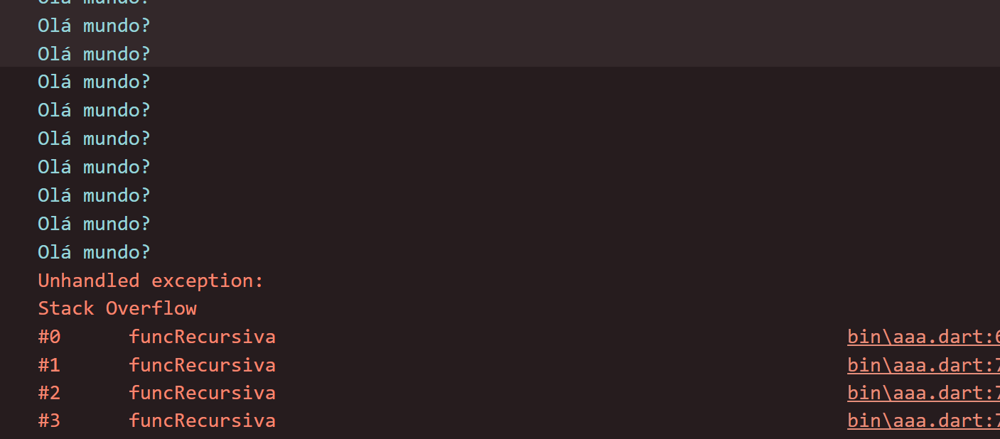
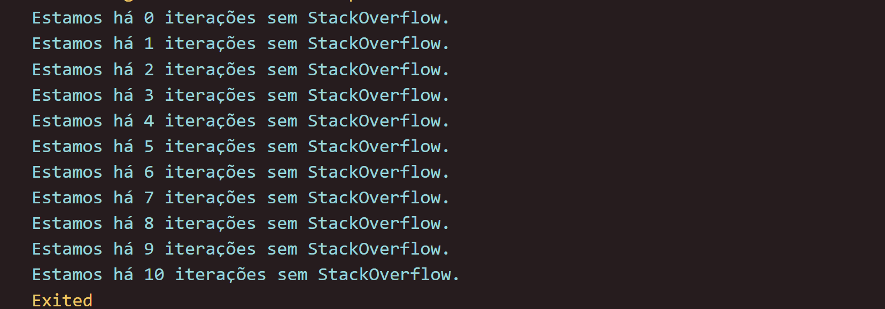

# Dart: entendendo a Orientação a Objetos

> `https://cursos.alura.com.br/course/dart-entendendo-orientacao-objetos`

## Faça esse curso de Flutter e

- Compreenda o que é o paradigma de Orientação a Objetos e como ele funciona na linguagem Dart
- Aprenda a programar utilizando funções e escopo
- Ganhe agilidade e evite repetir um mesmo código várias vezes
- Crie objetos complexos com mais de uma variável
- Represente coisas do mundo real com o paradigma Orientação a Objetos
- Conheça a importância de utilizar conceitos de herança, polimorfismo e classe abstrata
- Crie sua primeira classe com o Dart
- Melhore sua prática no dia a dia de trabalho, conhecendo pontos teóricos de O.O.

## Programação Orientada a Objetos

### Instalando e configurando o VSCode

- **Extensão Dart**

Buscar por “Dart” no campo de busca. Estamos buscando uma extensão chamada “Dart”, desenvolvida por “Dart Code”, que possui um símbolo de certificação. Quando encontrá-la, clique em “Install”.

### Começando na Orientação a Objetos

Agora que começamos a entender o conceito de paradigmas, em especial o de Orientação a Objetos, quais das alternativas abaixo representam melhor os conceitos aprendidos?

- Conhecer um paradigma garante que você vai dominar todas as linguagens que usam esse paradigma.
- Entender um paradigma não é tão importante quanto entender uma linguagem.
- O paradigma de Orientação a Objetos é o único usado no mercado atualmente.
- **Os paradigmas na programação são como uma metodologia (um estilo) de estruturar e executar a linguagem que usa esse paradigma.**
  - *Correto! Paradigmas definem características que a linguagem terá, por isso, linguagens que usam o mesmo paradigma tendem a ser parecidas entre si.*

### Dart e o OO

- Definindo o objeto

```dart
  String nome = 'Laranja';
  double peso = 100.2;
  String cor = "Verde e Amarela";
  String sabor = "Doce e cítrica";
  int diasDesdeColheita = 40;
  bool isMadura;
```

- Usando o objeto

```dart
  bool isMadura;

  if (diasDesdeColheita >= 30 ){
    isMadura = true;
  }else{
    isMadura = false;
  }
```

### 3 gatos

Seu vizinho pediu sua ajuda! Ele começou a programar em Dart e decidiu escrever um código que define cada um dos 3 gatos que ele tem:

```dart
//Garfield
  String nome1 = "Garfield";
  double peso1 = 6.5; //kg
  String cores1 = "Laranja";
  int idade1 = 4;
  bool isFofo1;

//Artemis
  String nome2 = "Artemis";
  double peso2 = 3.150;
  String cores2 = "Branca";
  int idade2 = 5;
  bool isFofo2;

//Jiraya
  String nome3 = "Jiraya";
  double peso3 = 3.3;
  String cores3 = "Preto e Amarelo";
  int idade3 = 6;
  bool isFofo3;
```

Usando seus conhecimentos sobre linguagens e paradigmas, se você pudesse dar uma opinião em relação ao código dele, qual seria o melhor feedback?

- **Incrível! Você tem muitos gatos! Mas eu diria que seu código é muito longo e pode diminuir consideravelmente se você aprender os conceitos de Orientação a Objetos. Dessa forma, seu código pode ser escrito em menos linhas!**
  - *Isso mesmo! O código está muito extenso e com muitas variáveis. Dessa forma, ele não será facilmente escalonável, dificultando o processo de utilização dos objetos. Ele poderia ser reduzido usando conceitos de Orientação a Objetos.*
- Wow, você conseguiu representar seus gatos com poucas linhas, seu código está muito sucinto!
- Existem erros na escrita do seu código, como no nome das variáveis, o que vai gerar problemas na hora de executar.
- Se você resolver anotar outras características dos seus gatos, por exemplo, se já foi vacinado ou não, seria fácil adicionar essa informação para todos os gatos.

### Para saber mais: outros paradigmas

Agora que já vimos o que é um paradigma e especificamente o que é o paradigma de Orientação a Objetos, você deve estar se perguntando:

> “*Quais são os outros paradigmas? Como eles funcionam?*”

Para te ajudar com isso separamos um [artigo completaço do GeekHunter](https://blog.geekhunter.com.br/quais-sao-os-paradigmas-de-programacao/) que pode facilitar sua vida.

### O que aprendemos na aula 1?

Nesta aula, aprendemos conceitos importantes sobre o Dart e a Orientação a objetos. Vamos relembrar?

- Trabalho Colaborativo:
  - Quando entramos no mundo do desenvolvimento de softwares, eventualmente vamos trabalhar em equipe, e isso significa que devemos saber lidar com diferentes formas de raciocínio lógico e diferentes formas de agir.
- VSCode:
  - Quando as pessoas trabalham colaborativamente, é comum que cada uma trabalhe em um ambiente diferente também! Neste curso, além do IntelliJ Community, que já usamos anteriormente, conhecemos o Visual Studio Code (ou só VSCode), e vimos que, mesmo sendo ambientes de trabalhos diferentes, podemos executar as mesmas tarefas em ambos se houver uma boa comunicação.
- Paradigmas:
  - Vimos que paradigmas são como crenças, visões ou formas de agir em relação a um problema. Existem diversos tipos de paradigmas na programação e o paradigma usado no Dart é o de Orientação a Objetos, que consiste nas ideias de Classes, Parentesco e Objetos.
- Orientação de Objetos no Dart:
  - No Dart, começamos a explorar os conceitos de objetos e reparamos que não há diferença no modo como havíamos criado nosso código anteriormente. No entanto, começamos a reparar que o código apenas com objetos simples se torna extremamente difícil de lidar.

Concluímos a Aula 1!

E esse é apenas o início do nosso curso. Se tiver dúvidas, não deixe de aparecer lá no fórum. Você poderá trocar ideias com outros colegas e ajudar respondendo dúvidas. Explicar um assunto para alguém é uma ótima forma de aprender e consolidar o conhecimento!

## Funções e Escopo

### Projeto da aula 1

Caso queira, você pode baixar o [projeto do curso](https://github.com/alura-cursos/dart-orientacao-objetos/archive/refs/heads/aula01.zip) no ponto em que paramos na aula anterior.

### Sintaxe de uma função

Aprendemos que podemos usar uma função quando queremos isolar um trecho de código para usá-lo várias vezes na nossa aplicação.

Imagine que você está escrevendo um código que organiza informações de pessoas em um banco de dados, e quando é aniversário de alguma delas, ele executa o seguinte código:

print("Parabéns para você!");
print("Nessa data querida!");
print("Muitas felicidades!");
print("Muitos anos de vida!");COPIAR CÓDIGO
Além de ser cansativo repetir esse trecho de código em vários lugares, se quisermos mudar a forma de dar parabéns para alguém no futuro, teremos que mudar em todas as repetições de código.

Vamos isolar isso em uma função? Quais das alternativas abaixo cria uma função que executa esse código?

```dart
mostrarParabens{}(
    print(“Parabéns para você!”);
    print(“Nessa data querida!”);
    print(“Muitas felicidades!”);
    print(“Muitos anos de vida!”);
);
```

```dart
mostrarParabens(){}
```

```dart
mostrarParabens(){
    print(“Parabéns para você!”);
    print(“Nessa data querida!”);
    print(“Muitas felicidades!”);
    print(“Muitos anos de vida!”);
}
```

- *Perfeito! Usamos a sintaxe da função perfeitamente e criamos exatamente o que tinha sido pedido!*

```dart
function mostrarParabens(){
    print(“Parabéns para você!”);
    print(“Nessa data querida!”);
    print(“Muitas felicidades!”);
    print(“Muitos anos de vida!”);
}
```

### Funções Frutíferas

Você está fazendo uma aplicação para uma quitanda, e no seu processo de modularização das operações, você precisa fazer uma função que receba todas as seguintes informações por parâmetros nomeados:

Nome (Obrigatório)
Peso (Obrigatório)
Cor (Opcional, sem valor padrão)
Sabor (Opcional, com valor padrão = “doce”)
Quais das opções abaixo definem os parâmetros dessa função?

```dart
funcFrutifera(required String nome, required double peso, {String? cor, String sabor = “doce”}){...}
```

```dart
funcFrutifera(String nome, double peso, {String? cor, String sabor = “doce”}){...}
```

```dart
funcFrutifera({required String nome, required double peso, String? cor, String sabor = “doce”}){...}
```

- *Perfeito! Como foi solicitado que todas as informações seriam recebidas via parâmetros nomeados, colocamos todos os parâmetros entre as chaves. Em nome e peso, usamos o modificador required para eles se tornem obrigatórios. Em cor, usamos uma String? para permitir valores nulos. E por fim, em sabor, definimos o valor padrão via atribuição como “doce”.*

```dart
funcFrutifera({String nome, double peso, String? cor, String sabor = “doce”}){...}
```

### Faça como eu fiz: quantos dias faltam?

Aprendemos, nos vídeos, para que servem e como criar funções. Agora é sua vez de praticar e criar uma função, utilizando seus conhecimentos da linguagem Dart e do paradigma Orientação a Objetos!

Como desafio, sugerimos que crie uma função que receba todas as informações utilizadas para representar uma fruta e que retorne uma String formatada contendo essas informações. Esse tipo de função é comumente chamada toString.

**Informações de uma Fruta**:

- Nome;
- Peso;
- Dias desde a Colheita;
- Dias para ficar madura;
- Se está madura ou não.

**Possível Saída (Leitura Convencional)**:

- A Laranja pesa 98 gramas! Ela foi colhida há 30 dias e precisa de 20 para amadurecer, logo, a Laranja está madura!

**Outra Possível Saída (Mais Direta)**:

- nome: “Laranja”,
- peso: 98,
- diasDesdeColheita: 30,
- diasParaMadura: 20,
- isMadura: true,

Fique à vontade para escolher uma das formas de representar nossa fruta como uma String e crie a função!

**Opinião do instrutor**.

Nessa atividade, o objetivo é que você treine a construção de funções e sua capacidade de resolver problemas. Assim, foi proposto que você desenvolvesse uma função com parâmetros, comportamentos e retorno definidos.

Na programação, há várias formas de resolver um mesmo problema, e essas diversas soluções possuem semelhanças e diferenças. No nosso caso, os parâmetros e o tipo do retorno não mudam, mas todo o resto (configurações dos parâmetros, lógica na função) podem mudar.

Uma das formas de resolver essa questão seria a seguinte:

```dart
String toString(
    {required String nome,
    required double peso,
    required diasDesdeColheita,
    int diasParaMadura = 30,
    bool? isMadura}) {
  if (isMadura == null) {
    isMadura = diasDesdeColheita >= diasParaMadura;
  }

  String maduraString = "";
  if (isMadura != null && !isMadura) {
    maduraString = "não ";
  }

  String result =
      "A $nome pesa $peso gramas! Ela foi colhida há  $diasDesdeColheita dias e precisa de  $diasParaMadura dias para amadurecer, logo, a $nome ${maduraString}está madura!";

  return result;
}
```

Mas, calma, como chegamos neste código? Vamos ver o passo a passo:

Em primeiro lugar, definimos que o tipo do retorno dessa função será String e que seu nome é toString, já que isso foi explicitamente solicitado.

Depois, configuramos os parâmetros. Nenhuma obrigatoriedade ou opcionalidade foi solicitada, portanto, isso estava à livre interpretação.

No exemplo, escolhemos que a função só teria parâmetros nomeados, e dentre esses colocamos apenas nome, peso e diasDesdeColheita como required, pois interpretamos que essas informações são insubstituíveis. Já sabor e diasParaMadura receberam valores padrão (também arbitrários à interpretação). Por fim, isMadura era uma informação que poderia ser obtida a partir de outras informações recebidas, então fazia sentido que ela fosse puramente opcional.

```dart
String toString(
    {required String nome,
    required double peso,
    required diasDesdeColheita,
    int diasParaMadura = 30,
    bool? isMadura}) {
```

Na sequência, fazemos uma verificação de se a informação de isMadura de fato chegou via parâmetro. Caso não, calculamos essa informação e preenchemos a variável nula.

```dart
if (isMadura == null) {
    isMadura = diasDesdeColheita >= diasParaMadura;
  }
```

Depois, criamos uma variável que vai ser útil na hora de criar nosso resultado via interpolação.

```dart
  String maduraString = "";
  if (isMadura != null && !isMadura) {
    maduraString = "não ";
  }
```

Por fim, criamos nossa String final, interpolando as variáveis com o texto legível e retornamos o valor gerado.

```dart
String result =
      "A $nome pesa $peso! Ela foi colhida há Por ter sido colhida a $diasDesdeColheita dias e precisar de , em média, $diasParaMadura dias para amadurecer, logo, a $nome ${maduraString}está madura!";

  return result;
```

Lembre-se de que, como foi dito, não há necessariamente uma forma correta de resolver esse problema, o importante é treinar os conceitos aprendidos!

### Para saber mais: Funções Recursivas

Convido você a ponderar a questão:

> O que aconteceria se uma função chamasse ela mesma?

Interessante pensar sobre isso, certo? Vamos começar pensando em uma função extremamente simples: Ela apenas mostra algo na tela, e chama ela mesma. O que aconteceria?

```dart
main() {
  funcRecursiva();
}

funcRecursiva() {
  print("Olá mundo?");
  funcRecursiva();
}
```

Se a função imprime algo e depois chama ela mesma, ela vai fazer isso indefinidamente, até gerar um erro que indica que o programa excedeu a quantidade máxima de chamadas recursivas definida pelo Sistema Operacional (o lendário StackOverflowException).



Se isso é uma repetição, é valido afirmar que nossa função é equivalente (em resultado) a um laço de repetição infinito:

```dart
main() {
  while (true) {
    print("Olá mundo?");
  }
}
```

Mas aprendemos que laços de repetições precisam de condições de parada para fazerem sentido. Será que podemos aplicar esse mesmo conceito a nossa função que chama ela mesma?

Podemos! Para isso precisamos passar alguma informação que vamos usar na condição de parada, em um exemplo mais simples, um contador:

```dart
funcRecursiva(int contador) {
  print("Estamos a $contador iterações sem StackOverflow.");
  funcRecursiva(contador + 1);
}
```

Adicionamos um novo parâmetro que será nosso contador e para cada nova chamada da função passamos esse mesmo contador incrementado com 1.

Interessante! Agora a cada chamada da função temos uma informação diferente chegando. Mas isso ainda não explica qual o momento que devemos parar a função! Para isso vamos adicionar um novo parâmetro!

```dart
funcRecursiva(int contador, int condicaoParada) {
  print("Estamos a $contador iterações sem StackOverflow.");
  funcRecursiva(contador + 1, condicaoParada);
}
```

Agora adicionamos a informação da condição de parada que é propagada para todas as chamadas da função sem se alterar. Mas isso não faz com que a função de fato pare de chamar ela mesma, precisamos testar esse contador!

```dart
funcRecursiva(int contador, int condicaoParada) {
  print("Estamos a $contador iterações sem StackOverflow.");
  if (contador >= condicaoParada) {
    return;
  }
  funcRecursiva(contador + 1, condicaoParada);
}
```

Adicionamos uma estrutura condicional para testar se o contador já está maior ou igual à condição de parada, se estiver, é chamado um return e a função imediatamente para sem chamar ela mesma.

Agora sim! Basta chamarmos essa função na main passando por argumento em que ponto queremos começar e em qual ponto queremos terminar!

```dart
main() {
  funcRecursiva(0, 10);
}

funcRecursiva(int contador, int condicaoParada) {
  print("Estamos há $contador iterações sem StackOverflow.");
  if (contador >= condicaoParada) {
    return;
  }
  funcRecursiva(contador + 1, condicaoParada);
}
```

Resultado no terminal:



Esse tipo de função que chama ela mesma é conhecida como “Função Recursiva”, e é bastante útil para resolver problemas mais complexos da área de computação que, em geral, envolvem algum tipo de repetição.

### O que aprendemos na aula 2?

Nessa aula, aprendemos conceitos importantes para você continuar nessa trilha de conhecimento. Os conceitos trabalhados aqui serão revistos de forma bem mais prática nas próximas aulas, por isso é importante dominá-los bem. Vamos fazer um resumo?

- **O que são Funções:**
  - Vimos que função é um trecho de código que, dadas algumas informações, faz uma ação e pode devolver algum valor! Essa estrutura pode ser chamada várias vezes no nosso código, assim, ganharmos tempo na hora de escrever e corrigir nossa aplicação. Falando de forma mais técnica: funções são a primeira forma de aplicar o conceito de modularização, o que quer dizer isolar tarefas que vão ser repetidas, isso é útil para criamos códigos mais legíveis, produtivos e eficientes.
- **Como criar Funções no Dart:**
  - Aprendemos que no Dart precisamos definir principalmente 4 aspectos da nossa função: O tipo do retorno dela, seu nome, seus parâmetros e seu código interno.
- **Como configurar os Parâmetros de uma Função no Dart:**
  - Conversamos que existem os parâmetros Posicionais Obrigatórios e os Nomeados Opcionais, e podemos dar um Valor Padrão para parâmetros que poderiam ser nulos e, caso necessário, podemos exigir que um parâmetro seja entregue com o modificador required.
- **Como funciona a ideia de Escopo:**
  - Por fim, vimos que desde que começamos a modularizar nosso código, temos que nos preocupar com a ideia de Escopo! Escopo é como se fosse o território, o terreno da função. Todo o código que está dentro das chaves {...} faz parte do escopo dela, portanto, esse código pertence e pode ser usado apenas por essa função. Para recebermos informações externas à função, podemos usar os parâmetros; para devolver uma informação para fora da função, podemos usar o return.
  
Concluímos a Aula 2!

## Classe

### Projeto da aula 2

Caso queira, você pode baixar o [projeto do curso](https://github.com/alura-cursos/dart-orientacao-objetos/archive/refs/heads/aula02.zip) no ponto em que paramos na aula anterior.

### Quando usar Classes?

Agora que aprendemos como criar uma classe no Dart, podemos usá-la ao nosso favor para resolver problemas no dia a dia de trabalho!

Quais dos seguintes problemas a seguir são resolvidos pela ideia de classe?

- Quando queremos testar se alguma condição é verdadeira ou falsa.
- Quando queremos isolar um trecho de código que faz uma operação que vai se repetir várias vezes.
- Quando queremos repetir várias vezes um trecho de código.
- **Quando queremos representar objetos ou um conceitos similares, com suas características e ações, para podermos usá-lo várias vezes.**
- *Perfeito! Diferentemente de uma função, a classe também pode armazenar características para um objeto, além de poder executar várias ações.*

### Para saber mais: outros Construtores

Você sabia que é possível personalizar seus construtores e ter mais de um construtor por classe?

E, além disso, esses construtores podem ser nomeados para que a pessoa que for usar a classe escolha qual construtor faz mais sentido para ela? Sim! Tudo isso é possível! Existem mais tipos de construtores.

A forma de fazer um construtor que aprendemos em vídeo é o jeito mais rápido, simples e direto de criar um construtor em Dart, um que apenas inicializa as propriedades usando parâmetros posicionais obrigatórios:

```dart
class Fruta{
  String nome;
  String cor;

  Fruta(this.nome, this.cor);
}
```

Podemos criar um novo construtor (agora um construtor nomeado) se, por exemplo, quisermos usar apenas Parâmetros Nomeados! Basta seguir a seguinte estrutura:

```dart
class Fruta{
  String nome;
  String cor;

  Fruta(this.nome, this.cor);

  Fruta.nomeados({required this.nome, required this.cor});
}
```

Note que os construtores são independentes. Ou seja, na hora que você vai criar um objeto usando essa classe, você só vai poder usar um dos construtores. Dito isso, é importante notar que todo construtor precisa preencher as propriedades que não podem ser nulas, daí usamos o required no nosso construtor .nomeados.

No código abaixo, vemos como inicializar objetos diferentes usando cada um dos nossos construtores:

```dart
main() {
  Fruta laranja = Fruta("Laranja", "Verde"); // Criando o objeto com o construtor padrão
  Fruta uva = Fruta.nomeados(nome: "Uva", cor: "Roxo"); // Criando o objeto com o construtor nomeado
}
```

Além de inicializar as propriedades, também podemos executar algumas operações durante o construtor. Para fazer isso, basta criá-lo com uma estrutura similar a da criação de uma função:

```dart
class Fruta{
  String nome;
  String cor;

  Fruta(this.nome, this.cor);

  Fruta.nomeados({required this.nome, required this.cor});

  Fruta.minusculas(this.nome, this.cor){
    nome = nome.toLowerCase();
    cor = cor.toLowerCase();
  }
}
```

No construtor acima nomeado minusculas, após receber por parâmetro as informações que preencherão as propriedades, usamos o toLowerCase() em cada uma delas para que o conteúdo textual se torne minúsculo. Esse é só um exemplo, e as mais diversas manipulações podem ser feitas nesse tipo de construtor.

Pronto! Agora podemos fazer operações no nosso próprio construtor, e elas acontecerão durante a inicialização do objeto (caso ele seja inicializado usando esse construtor).

### Fazendo jogos

Você está desenvolvendo uma classe que vai representar a heroína de um jogo de ação. Essa heroína tem as seguintes características:

- **Nome;**
- **Pontos de Vida;**
- **Pontos de Magia;**
- **Velocidade;**
- **Dano de Ataque; e**
- **Se está viva ou não.**

Além disso, ela tem as seguintes ações: **andar, atacar, usar magia**.

Quais das classes a seguir melhor representaria, em Dart, nossa heroína?

```dart
class Heroine{
String nome;
int pontosVida;
int pontosMagia;
double velocidade;
double danoAtaque;
bool? isViva;

Heroine({required this.nome, required this.pontosVida, required this.pontosMagia, required this.danoAtaque, required this.velocidade, this.isViva});

void atacar(){...}
void andar(){...}
void usarMagia(){...}
}
```

- *Perfeito! Poderíamos não usar parâmetros nomeados, porém, se escolhemos usá-los, é necessário usar o modificador required para todos os parâmetros que apontam para propriedades que não podem ser nulas.*

```dart
class Heroine{
String nome;
int pontosVida;
int pontosMagia;
double velocidade;
double danoAtaque;
bool? isViva;

void atacar(){...}
void andar(){...}
void usarMagia(){...}
}
```

```dart
class Heroine{
String nome;
int pontosVida;
int pontosMagia;
double velocidade;
double danoAtaque;
bool? isViva;

Heroine({this.nome, this.pontosVida, this.pontosMagia, this.danoAtaque, this.velocidade, this.isViva});

void atacar(){...}
void andar(){...}
void usarMagia(){...}
}
```

```dart
class Heroine{
String nome;
int pontosVida;
int pontosMagia;
double velocidade;
double danoAtaque;
bool? isViva;

Heroine(this.nome, this.pontosVida, this.pontosMagia, this.danoAtaque, this.velocidade, {this.isViva});

void atacar(){...}
void andar(){...}
void usarMagia(){...}
}
```

- *Perfeito! Usamos nesse caso Parâmetros Posicionais Obrigatórios, para obrigar a pessoa que vai usar essa classe a passar as informações das propriedades que não podem ter valores nulos.*

### Faça como eu fiz

Chegou a hora de você seguir todos os passos realizados pela gente durante esta aula. Caso já tenha feito, excelente. Se ainda não, é importante que você execute o que foi visto nos vídeos para poder continuar com a próxima aula.

### O que aprendemos na aula 3?

Muito bom! Você chegou ao final de mais uma aula e o que aprendemos?

- **O que é uma Classe:**
  - Classes são os moldes que usamos para construir e representar coisas do mundo real. A partir desses moldes, podemos construir objetos específicos e com características semelhantes. Falando de forma mais técnica, criar uma classe é uma forma modularizada e produtiva de escrever código. Nelas, conseguimos representar as características de objetos através das Propriedades e suas ações através dos métodos.
- **O que são as Propriedades de uma Classe:**
  - Vimos que as propriedades de uma classe são as características (informações) que desejamos registrar sobre os objetos que serão gerados por essa classe. Aprendemos que algumas informações podem ser informadas já na criação da classe, mas outras precisarão vir externamente via Construtor.
- **O que é o Construtor:**
  - Aprendemos também que Construtores são como aquele “check-list” de passos a serem tomados antes de começar uma viagem: é o método que será executado assim que um objeto dessa classe for criado. A sua principal tarefa normalmente é inicializar as Propriedades, mas os Construtores também podem executar ações iniciais que a classe possa demandar.
- **O que são Métodos:**
  - Por fim, vimos que os Métodos são como funções dentro de uma classe e determinam os comportamentos que os objetos que serão gerados por essa classe terão.

## Herança

### Projeto da aula 3

### O que é Herança?

### Para saber mais: Herança na Orientação a Objetos

### Herança no Dart

### Membros da Herança

### Herdando métodos

### Faça como eu fiz: Classes e heranças

### O que aprendemos na aula 4?

## Polimorfismo e Classes Abstratas

### Projeto da aula anterior

### O que é uma Classe Abstrata

### Classe Abstrata

### Polimorfismo e Sobrescrita

### Polimorfismo

### Faça como eu fiz: Polimorfismo e Sobrescrita

### Projeto de final do curso

### O que aprendemos?

### Conclusão
