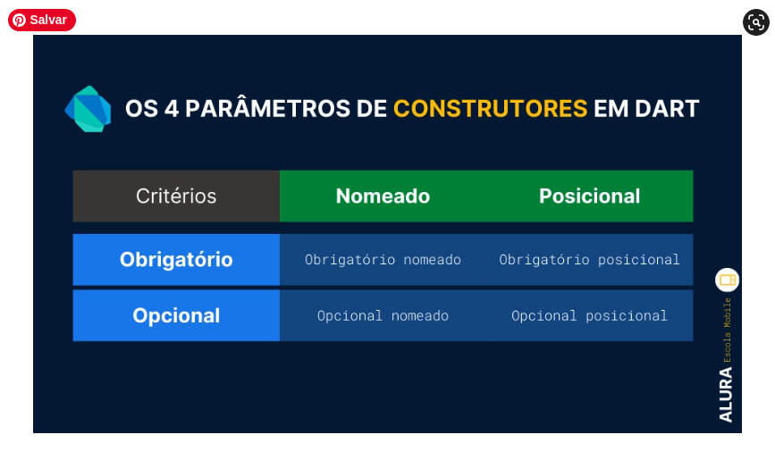
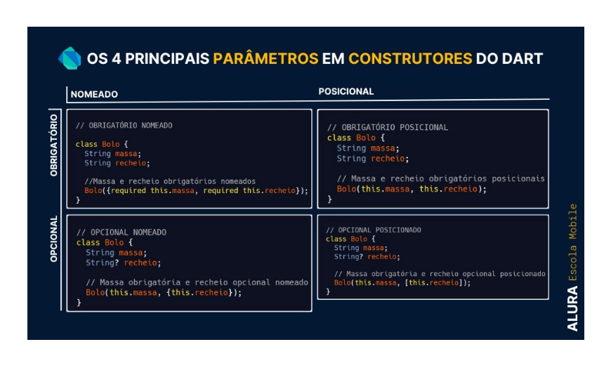
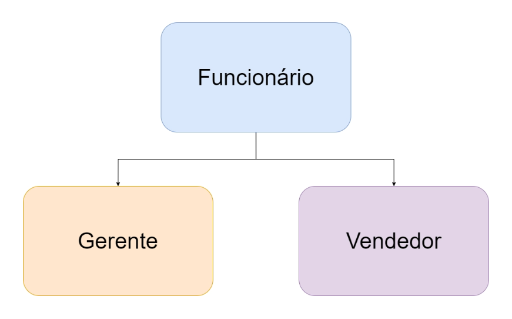

# Construtores no Dart: conhecendo tipos de construtores e como usá-los

## Introdução

Se você já conhece Dart, ou até mesmo está iniciando seus estudos nessa linguagem, pode se deparar com as diversas formas de desenvolver um construtor: algumas são parecidas com outras linguagens e por isso podem ser mais facilmente assimiladas, e outras, mais complexas, precisam de um pouquinho mais de pesquisa e prática.

Entender o que são construtores, quais tipos existem e como usá-los pode te ajudar a fazer códigos ainda mais legíveis e otimizados, vamos mergulhar nessa leitura para aprender mais sobre o assunto?

## O que são construtores?

Dart é uma linguagem que segue o paradigma de [Orientação a Objetos (OO)](https://www.alura.com.br/curso-online-dart-entendendo-orientacao-objetos), ou seja, utiliza o conceito de classe, que nada mais é do que a representação de objetos com características e comportamentos em comum. Simplificando, a classe é um “molde” ou uma “forma” (no sentido de forma de bolo, por exemplo). Vamos ver um exemplo?

Imagine que queremos representar diversos funcionários de um escritório de vendas de papéis e materiais de escritório chamado Dunder Mifflin, que possui vários funcionários (recepcionista, vendedores, gerente, entre outros). Podemos criar a classe de um objeto chamado Funcionario, em Dart:

```dart
class Funcionario {
  final String nome;
  final int idade;
  final String funcao;
  final String hobby;
}
```

Esta classe (funcionário) possui quatro atributos ou características, que são nome, idade, cargo e hobby. Agora podemos criar uma instância (um objeto) dessa classe, e é aí que entram os construtores.

Assim, os construtores “constroem” objetos (instâncias) a partir de uma classe - vamos entender isso, na prática, a seguir.

## Construtor padrão e Syntax sugar

Caso você não implemente seu construtor em uma classe, o Dart gera um construtor padrão, e, ao criarmos uma instância dessa classe, ele é chamado. Porém, esse construtor não possui argumentos e normalmente não é isso que queremos.

**Logo, vamos criar nosso construtor**!

Ainda utilizando a classe Funcionario, do exemplo anterior, o construtor deve receber um parâmetro chamado nome (do tipo String, ou seja, uma cadeia de caracteres), outro chamado idade (do tipo int, um valor numérico inteiro), e por último cargo e hobby (ambos também do tipo String):

```dart
class Funcionario {
  String? nome;
  int? idade;
  String? funcao;
  String? hobby;

  Funcionario(String nome, int idade, String funcao, String hobby) {
    this.nome = nome;
    this.idade = idade;
    this.funcao = funcao;
    this.hobby = hobby;
  }
}
```

> *Repare que estamos usando o sinal ? na frente da declaração dos tipos de nossas variáveis. Por quê? Isso acontece pois, nesse tipo de construtor, essas variáveis devem ser “nullables”, isto é, receberem valores nulos ou não. Caso queira se aprofundar no assunto, recomendo a leitura do artigo [Flutter - Null Safety](https://www.alura.com.br/artigos/flutter-null-safety) e também o curso [Dart: lidando com Exceptions e Null Safety](https://www.alura.com.br/curso-online-dart-lidando-exceptions-null-safety).*

Existe ainda uma forma de escrever exatamente a mesma declaração, de forma bem mais simplificada, utilizando o chamado Syntax Sugar (Sintaxe doce, em livre tradução).

Mas… o que é isso, mesmo?

Syntax Sugar é definido como uma forma de “adocicar” o código, ou seja, simplificar e facilitar a escrita e a leitura/compreensão do código. Dá uma olhada em como ficaria o nosso construtor com a Syntax Sugar:

```dart
class Funcionario {
  String nome;
  int idade;
  String funcao;
  String hobby;

  Funcionario(this.nome, this.idade, this.funcao, this.hobby);
}
```

Observe que, nesse caso, não usamos o sinal ? na declaração dos nossos atributos, pois o objeto Funcionario, ao ser inicializado, terá necessariamente valores não nulos!

Tanto para o construtor comum quanto para o construtor que utiliza Syntax Sugar, podemos criar a instância do objeto Funcionario da seguinte forma:

```dart
  Funcionario funcionario = Funcionario("Pam", 26, "Recepcionista", "Artes");
```

Legal! Agora criamos nosso objeto Funcionario utilizando um construtor e passando - através dos parâmetros - o nome, a idade, cargo e o hobby.

Mas existem outras formas de passar esses parâmetros, deixando-os opcionais, obrigatórios, com nomes ou utilizando posições. Vamos conhecê-las?

## Parâmetros em construtores

Quando falamos sobre construtores em Dart, é essencial comentar sobre os quatro principais parâmetros que podemos utilizar:

1. Opcionais posicionais;
1. Opcionais nomeados;
1. Obrigatórios posicionais; e
1. Obrigatórios nomeados.



*Principais construtores em Dart*.

Complicou? Vamos com calma!

Antes de vermos exemplos de cada um deles, precisamos entender o que significam os termos posicional, nomeado, obrigatório e opcional.

Imagine que estamos construindo a aplicação para registrar o cadastro de funcionários do escritório. Existem dois tipos de informações das pessoas.

1. **Informações obrigatórias:** nome, idade, cargo;
1. **Informações opcionais:** como hobby.

Pensando, primeiro, nas informações obrigatórias (como nome, idade e cargo), podemos relacioná-las com os parâmetros obrigatórios: são aqueles que obrigatoriamente precisamos passar através do construtor no momento da chamada, ou seja, não podemos deixá-los vazios.

Em contrapartida, temos informações opcionais que estão ligadas aos parâmetros opcionais - os quais são o oposto do obrigatório -, pois eles podem ou não ser passados através do construtor (como o hobby, por exemplo). O nome diz tudo: são parâmetros opcionais na hora de passá-los no construtor. Tudo depende da escolha da pessoa programadora no momento da criação do objeto.

Agora, para entender melhor os parâmetros posicionais e nomeados:

- Parâmetros posicionais são aqueles que precisam estar numa posição específica durante a criação do objeto com o construtor;
- Os parâmetros nomeados não precisam de uma posição ou ordem específica, pois eles recebem e são identificados por nomes específicos.
Vamos ver alguns exemplos?

## Parâmetros Opcionais Posicionais

Vimos que:

- Parâmetros opcionais são aqueles que não precisamos necessariamente passá-los através do construtor (na hora de criar um objeto);
- Parâmetros posicionais precisam estar em uma ordem específica para serem reconhecidos.
Abaixo, veja um exemplo no qual o parâmetro hobby é transformado em opcional posicional:

```dart
  Funcionario(this.nome, this.idade, this.funcao, [this.hobby]);
```

Nesse exemplo, podemos (ou não) passar o parâmetro hobby e, dessa maneira, o atributo precisa ser nullable, isto é, pode (ou não) ser nulo. Para deixá-lo nulo, escrevemos um sinal de ? na definição do seu tipo dentro da classe:

```dart
class Funcionario {
  String nome;
  int idade;
  String funcao;
  String? hobby;

  Funcionario(this.nome, this.idade, this.funcao, [this.hobby]);
}
```

Outra opção é atribuir um valor à variável dentro do próprio construtor, assim, caso não seja passado nenhum valor, a variável ainda assim não será nula. Por exemplo, se quisermos que, por padrão, quando não passamos o valor de hobby ela seja Sem Hobby, podemos fazer da seguinte maneira:

```dart
  Funcionario(this.nome, this.idade, this.funcao, [this.hobby = "Sem Hobby"]);
```

Em ambos os casos, tanto utilizando uma variável nullable na classe quanto utilizando um valor padrão no construtor, podemos criar objetos que podem ou não ter o atributo hobby, veja só:

```dart
  Funcionario funcionario = Funcionario("Pam Beesly", 26, "Recepcionista", "Artes");
  Funcionario funcionario2 = Funcionario("Pam Beesly", 26, "Recepcionista");
```

Você pode se perguntar:

> “*E se eu criar um objeto do tipo Funcionario com os atributos em ordens diferentes?*”

Nessa situação, caso você troque valores de variáveis do mesmo tipo no construtor, não haverá erros (é tranquilo trocar nome por cargo ou hobby - todos são strings), mas se forem tipos diferentes, haverá problema (como trocar idade por nome e/ou cargo e/ou hobby - ou seja, trocar um int por string), exemplo:

```dart
Funcionario funcionario = Funcionario("Jim Halpert", "Vendedor", 26, “Pegadinhas”);
```

O código acima gera um erro de compilação com a seguinte mensagem: “O tipo de argumento 'String' não pode ser atribuído ao tipo de parâmetro 'int”, pois trocamos a ordem dos valores de cargo por idade.

Fez sentido?

## Parâmetros Opcionais Nomeados

Quando usamos parâmetros opcionais nomeados, eles podem (ou não) ser passados, porém eles possuem nomes, ou seja, são identificados através de nomeações e não posições. Vamos tornar o atributo hobby opcional e nomeado:

```dart
  Funcionario(this.nome, this.idade, this.funcao, {this.hobby});
```

Como você vê, usamos chaves - {} - para criar parâmetros opcionais e nomeados.

Do mesmo modo que no exemplo anterior, ao tornar essa variável opcional, ela pode ou não ser nula. Portanto, devemos adicionar o sinal ? na frente do seu tipo ou podemos usar um valor padrão dentro do próprio construtor (para que ela seja preenchida e, assim, não seja nula):

```dart
class Funcionario {
  String nome;
  int idade;
  String funcao;
  String? hobby;

  Funcionario(this.nome, this.idade, this.funcao, {this.hobby});
}
```

Uma alternativa seria:

```dart
class Funcionario {
  String nome;
  int idade;
  String funcao;
  String hobby;

  Funcionario(this.nome, this.idade, this.funcao, {this.hobby = "Sem Hobby"});
}
```

E, para os dois exemplos mostrados acima, criamos nossos objetos da seguinte forma:

```dart
  Funcionario funcionario = Funcionario("Pam Beesly", 26, "Recepcionista", hobby: "Artes");
  Funcionario funcionario2 = Funcionario("Pam Beesly", 26, "Recepcionista");
```

## Parâmetros Obrigatórios Posicionais

Como aprendemos:

- Parâmetros obrigatórios são aqueles que necessariamente precisam ser passados através do construtor;
- Parâmetros posicionais são aqueles que precisam estar numa posição específica quando passados.

Esse tipo de construtor é exatamente o que utilizamos em nosso primeiro exemplo de Syntax Sugar, veja:

```dart
class Funcionario {
  String nome;
  int idade;
  String funcao;
  String hobby;

  Funcionario(this.nome, this.idade, this.funcao, this.hobby);
}
```

Quando passamos os valores para o construtor, eles precisam estar completos (sem parâmetros a mais ou a menos) e na posição correta (nome, idade, cargo, hobby):

```dart
    Funcionario funcionario = Funcionario("Pam Beesly", 26, "Recepcionista", "Artes");
```

Esses são os parâmetros mais rígidos: a posição específica não pode mudar, porém o valor pode mudar (se for do mesmo tipo).

## Parâmetros Obrigatórios Nomeados

Você pode querer também utilizar parâmetros obrigatórios que sejam nomeados, para que não precisem estar em um ordem específica e até mesmo para deixar mais legível a construção do seu objeto.

E, para torná-lo nomeado, pode utilizar chaves ({}).

Contudo, se utilizar apenas as chaves, verá que eles se tornam nomeados opcionais, logo, utilizamos um modificador chamado required na frente do argumento que deve ser obrigatório, tornando-o necessário para o construtor. Abaixo, um exemplo:

```dart
class Funcionario {
  String nome;
  int idade;
  String funcao;
  String hobby;

 Funcionario({required this.nome, required this.idade, required this.funcao,  required this.hobby});
}
```

Tornamos os parâmetros nome, idade, cargo e hobby nomeados e obrigatórios e, dessa maneira, na criação de um objeto com esse tipo de construtor, faríamos da seguinte forma:

```dart
  Funcionario funcionario = Funcionario(nome: "Pam Beesly", idade: 26, funcao: "Recepcionista", hobby: "Artes");
```

## Resumindo os quatro principais parâmetros em Dart

Para sintetizar os parâmetros dos construtores, deixo um infográfico com uma classe chamada Bolo, com massa e recheio; nessa classe, podemos deixar alguns atributos obrigatórios, outros opcionais e nomeados ou posicionais. Vamos ver:



*Os 4 principais parâmetros em construtores no Dart*.

## Construtor nomeado

O Dart nos permite criar vários construtores dentro de uma mesma classe.

Como fazemos isso?

Bem, usamos os chamados construtores nomeados, que nada mais são do que construtores com nomes.

E qual a vantagem disso? Bom, os construtores nomeados apresentam duas vantagens:

1. Sobrecarga de construtores: Esse é o termo técnico para quando temos mais de um construtor dentro de uma classe. Às vezes, queremos que cada construtor tenha uma função específica; para diferenciá-los, colocamos um nome diferente para cada um. Isso permite mais liberdade ao escrever uma classe;
1. Legibilidade do código: construtores nomeados tornam o código mais legível e retornam uma instância exata de um objeto, assim como um construtor comum.

Imagine que, agora, em nosso cadastro de funcionários, existem casos em que o funcionário quer informar o hobby e casos em que ele não quer. Como solucionamos esse problema?

Poderíamos resolver isso utilizando um parâmetro opcional.

Outra solução seria usar mais um construtor! Assim, ficariam dois construtores:

O primeiro (não nomeado) retorna uma instância com o atributo hobby;
O segundo (nomeado como semHobby) retorna uma instância sem o atributo hobby.
Com a solução dos dois construtores nomeados, o código fica bem mais legível:

```dart
class Funcionario {
  String nome;
  int idade;
  String funcao;
  String? hobby;

  Funcionario(this.nome, this.idade, this.funcao, this.hobby);

  Funcionario.semHobby(this.nome, this.idade, this.funcao);
}
```

Agora temos dois construtores: um comum, que possui o atributo hobby, e outro nomeado, que não possui o atributo hobby. Podemos fazer uso dos dois sem problemas, veja:

```dart
Funcionario funcionario1 = Funcionario("Pam", 26, "Recepcionista", "Artes");
Funcionario funcionario2 = Funcionario.semHobby("Dwight Schrute", 35, "Assistente Gerente Regional");
```

## Construtor constante

Existem situações em que pode ser melhor criar objetos que não possam ser alterados, por fazer mais sentido e também em prol do desempenho da aplicação, visto que objetos que têm seus valores definidos e inalterados consomem menos memória que outros. Como poderíamos fazer isso em Dart?

Para criar uma instância da sua classe que não mude, podemos utilizar um construtor constante. Este construtor usa um modificador de imutabilidade chamado const, que determina que o objeto não pode inicializar sem um valor e também que, após receber um valor, ele não pode ser alterado.

Os atributos da classe utilizados nesse construtor, precisam (também) de outro modificador de imutabilidade chamado final que, diferente de const, não precisa ter um valor inicial na sua declaração, mas que também não pode ser alterado ao receber um valor. Vamos ver um exemplo:

```dart
class Funcionario {
  final String nome;
  final int idade;
  final String funcao;
  final String hobby;

  const Funcionario(this.nome, this.idade, this.funcao, this.hobby);
}
```

Quando criamos uma instância dessa classe com esse tipo de construtor, usamos novamente o modificador const e não podemos alterar posteriormente qualquer atributo (ou recebemos um erro de compilação):

```dart
Funcionario funcionario = const Funcionario("Michael Scott", 40, "Gerente Regional", "Improviso");
 funcionario.idade = 28; // erro de compilação
```

Se quiser saber mais sobre const, final (e até mesmo outro modificador chamado static), recomendo a leitura do artigo [Qual a diferença entre Static, Const e Final no Dart](https://www.alura.com.br/artigos/diferenca-entre-static-const-final-no-dart).

## Construtor de fábrica

Para entendermos o que é o construtor de fábrica, é importante começarmos conhecendo o Método de Fábrica (em inglês, Factory Method), um [Design Pattern](https://www.alura.com.br/artigos/design-patterns-introducao-padroes-projeto), que nos auxilia na criação de objetos, aumentando a flexibilidade e reutilização de código.

O Método de Fábrica consiste em criar objetos sem expor a lógica de criação ao cliente; vejamos um exemplo:



*Diagrama*.

Observando o diagrama acima, descobrimos que é possível criar um código que tenha uma classe mãe chamada Funcionario e duas classes filhas chamadas Gerente e Vendedor, que devem ter as mesmas características da sua classe mãe. O conceito usado para explicar esse cenário se chama herança, pois as classes filhas herdam os atributos e métodos da classe mãe. Vamos desenvolver nosso código:

```dart
// Classe mãe
class Funcionario {
  String nome;
  int idade;
  String hobby;

  Funcionario(this.nome, this.idade, this.hobby);
}

// Classe filha
class Gerente extends Funcionario {
  Gerente(super.nome, super.idade, super.hobby);
}

// Classe filha
class Vendedor extends Funcionario {
  Vendedor(super.nome, super.idade, super.hobby);
}
```

Dessa maneira, como você pode observar, não temos mais o atributo cargo, pois vamos utilizar uma lógica interna (dentro da classe Funcionario) para definir qual instância devemos retornar (Gerente ou Vendedor). Para isso, precisamos então utilizar o nosso construtor de fábrica, usando a palavra chave factory na frente do construtor nomeado e retornando para cada caso uma instância diferente:

```dart
// Classe mãe
class Funcionario {
  String nome;
  int idade;
  String hobby;

  Funcionario(this.nome, this.idade, this.hobby);

  // Construtor de fábrica
  factory Funcionario.criar(String nome, int idade, String hobby,
      {String funcao = ""}) {
    switch (funcao) {
      case "Gerente":
        return Gerente(nome, idade, hobby);
      case "Vendedor(a)":
        return Vendedor(nome, idade, hobby);
      default:
        return Funcionario(nome, idade, hobby);
    }
  }
}
```

No código acima, temos um parâmetro opcional nomeado chamado cargo que recebemos a fim de usar uma estrutura de seleção condicional (switch case), na qual analisamos esse parâmetro e, para cada caso, retornamos algo diferente:

- se recebermos “Gerente”, retornamos uma instância do tipo Gerente;
- se recebermos “Vendedor(a)”, retornamos uma instância do tipo Vendedor; e
- caso a gente não receba nada (ou chegue algo que não se encaixe nas opções anteriores), apenas retornamos uma instância de Funcionario.
Podemos testar nosso construtor criando uma instância para cada caso, dá uma olhada:

```dart
  // Instância de Gerente:
  Funcionario gerente = Funcionario.criar("Michael Scott", 47, "Improviso", funcao: "Gerente");
  // Instância de Vendedor:
  Funcionario vendedor = Funcionario.criar("Jim Halpert", 26, "Pegadinhas", funcao: "Vendedor(a)");
```

Legal, não é? Agora a nossa lógica de criação de objetos está bem mais organizada e você pode inclusive criar outros cargos (classes filhas) e adicionar à lógica.

## Construtor de redirecionamento
Um construtor de redirecionamento pode ser usado em quatro casos para:

1. Redirecionar a um outro construtor;
1. Produzir um construtor comum;
1. Fazer um construtor com verificações;
1. Invocar uma classe mãe.

Vamos ver um exemplo de cada caso!

Para entender melhor os casos, vamos antes entender um conceito importante: a lista de inicializadores.

## Entendendo a lista de inicializadores

O construtor redirecionador usa um conceito chamado “Lista de Inicializadores”. Assim, para entender esse conceito, vamos usar um exemplo muito usado no cotidiano da pessoa programadora de Dart que é a aplicação que lida com conexão à internet.

É comum que informações da internet venham em um formato conhecido chamado JSON que pode ser transformado em um formato de variável chamado map.

> *Caso não saiba o que é um Map, por enquanto você só precisa entender que Map é um tipo de dado bastante utilizado, como uma string ou int.*

Nesse caso, o redirecionamento pode ser utilizado para receber um valor do tipo JSON na nossa classe e inicializar os atributos do objeto. Veja, abaixo, um exemplo em que temos um construtor nomeado chamado fromJson (em português, “de Json”) que recebe um dado map e constrói o objeto a partir dele:

```dart
class Funcionario {
  String nome;
  int idade;
  String funcao;
  String hobby;

  Funcionario(this.nome, this.idade, this.funcao, this.hobby);

  Funcionario.fromJson(Map<String, dynamic> map)
      : nome = map['nome'],
        idade = map['idade'],
        funcao = map['funcao'],
        hobby = map['hobby'];
}
```

Podemos perceber, portanto, que cada linha separada por vírgula é um trecho de código que faz a inicialização de uma propriedade. Podemos usar a Lista de Inicializadores para inicializar cada propriedade uma a uma, mas também é possível inicializar todos de uma vez com a ajuda de um construtor que já existe, e é exatamente isso que é um Construtor Redirecionador!

## Conhecendo o construtor “redirecionador”

Começando por um exemplo em que queiramos redirecionar um construtor para outro: imagine que temos dois construtores: um nomeado (semHobby), e outro comum. Assim, queremos que o construtor nomeado apenas redirecione para o comum e atribua à hobby o valor null.

```dart
class Funcionario {
  String nome;
  int idade;
  String funcao;
  String? hobby;

  Funcionario(this.nome, this.idade, this.funcao, this.hobby);

  Funcionario.semHobby(String nome, int idade, String cargo)
      : this(nome, idade, cargo, null);

}
```

> *É importante que você saiba que essa técnica existe. Porém, o Dart recomenda o uso da opção a seguir baseada na Syntax Sugar.*

## Usando o construtor de redirecionamento comum

Ele também pode ser aplicado como um construtor comum, sem alterações no funcionamento normal, embora a sintaxe simplificada (Syntax Sugar) seja mais usada, veja:

```dart
class Funcionario {
  String nome;
  int idade;
  String funcao;
  String hobby;

  Funcionario(String nome, int idade, String funcao, String hobby)
      : nome = nome,
        idade = idade,
        funcao = funcao,
        hobby = hobby;
}
```

## Usando o construtor de redirecionamento para fazer verificações

Utilizamos esse caso quando queremos fazer testes automatizados em um projeto. Ele faz verificações utilizando o assert, no qual podemos usar um construtor com redirecionamento que testa se um valor satisfaz alguma condição, por exemplo:

```dart
class Funcionario {
  String nome;
  int idade;
  String funcao;
  String hobby;

  Funcionario(this.nome, this.idade, this.funcao, this.hobby) : assert(idade >= 18);
}
```

No exemplo acima, estamos verificando se o valor do parâmetro idade é maior ou igual a 18.

Vale ressaltar que o objeto é criado mesmo que não satisfaça a condição, visto que essa verificação é útil apenas para testes no Dart.

## Usando construtor de redirecionamento para invocar uma classe mãe

Por fim, você pode já saber que o redirecionamento é usado quando trabalhamos com herança, isto é, uma classe herda características e comportamentos de outra.

No exemplo utilizado no tópico sobre Construtor de Fábrica, não utilizamos o construtor de redirecionamento, mas poderíamos! Veja:

```dart
// Classe filha: Gerente
class Gerente extends Funcionario {
  Gerente(String nome, int idade, String hobby) : super(nome, idade, hobby);
}
```

No exemplo acima, estamos utilizando um construtor de redirecionamento na classe filha chamada Gerente que estende da mãe Funcionario.

## Conclusão

Parabéns por ter concluído a leitura!

Agora você já deve ser capaz de compreender o que são e como utilizar os diversos construtores que apresentei: comum, syntax sugar, nomeado, constante, de fábrica e redirecionamento, além dos tipos de parâmetros que podemos usar neles.

E se quiser aprofundar mais ainda seus estudos em Orientação a Objetos, acesse o curso [Dart: Entendendo a orientação a objetos!](https://www.alura.com.br/curso-online-dart-entendendo-orientacao-objetos) da nossa formação [Dart](https://www.alura.com.br/formacao-dart) que ensina desde a preparação de ambiente até assuntos mais avançados.

Bons estudos!

## Jhoisnáyra Vitória Rodrigues de Almeida

Jhoisnáyra é estudante de Ciência da Computação na Universidade Federal do Piauí e atualmente faz parte do Scuba Team de Mobile. Formada em Eletrônica pelo Instituto Federal do Piauí e pesquisadora da área de Redes de Computadores. Apaixonada por programação, eletrônica e desenvolvimento mobile.
