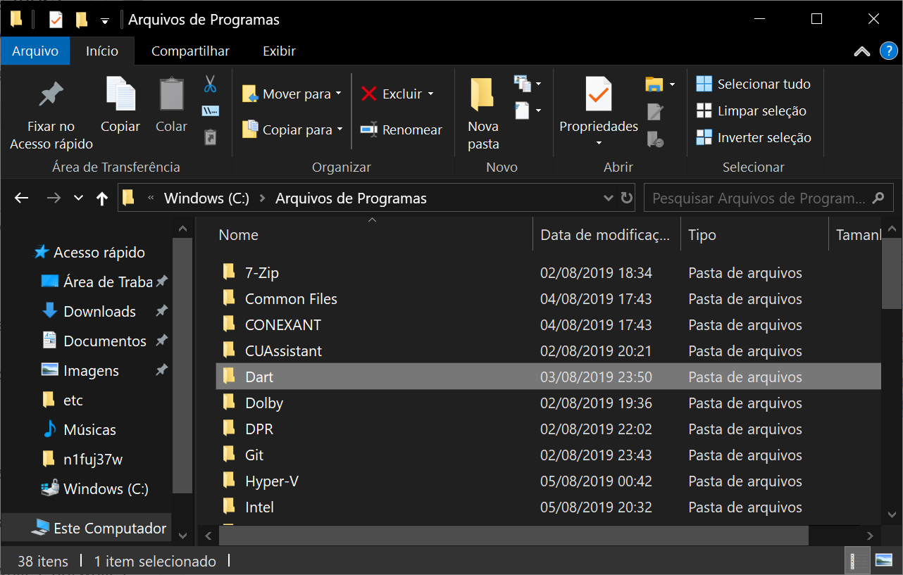
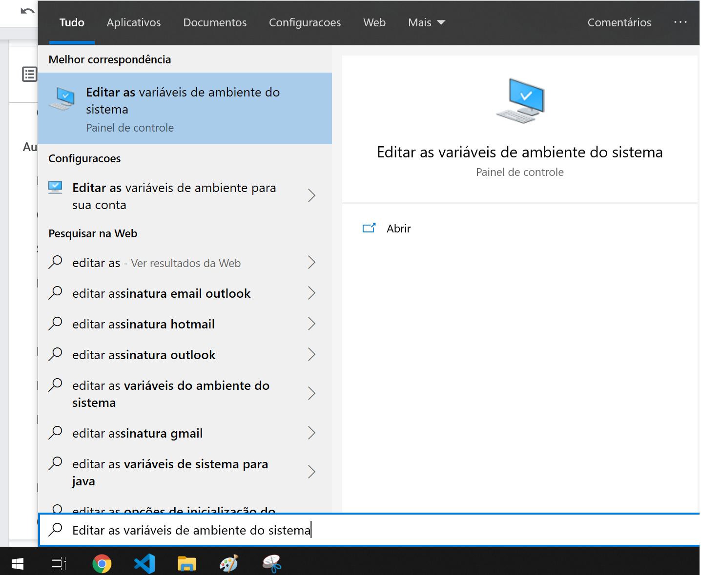
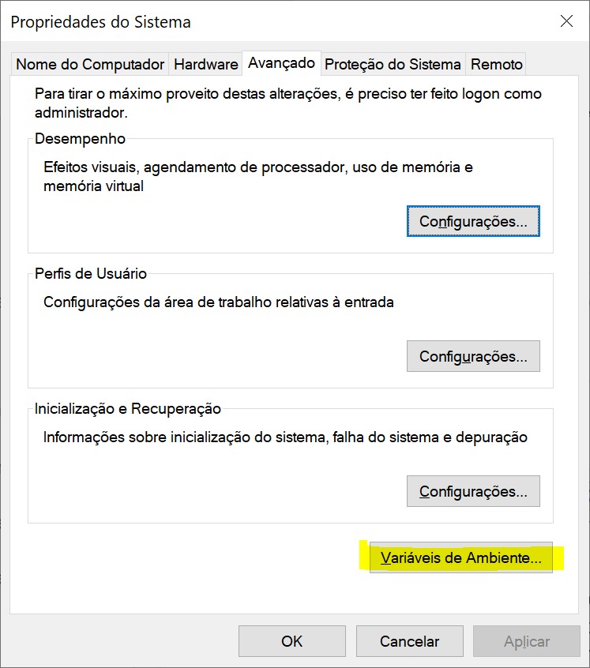
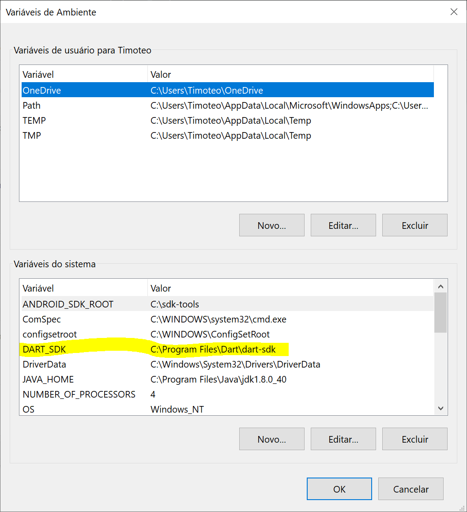
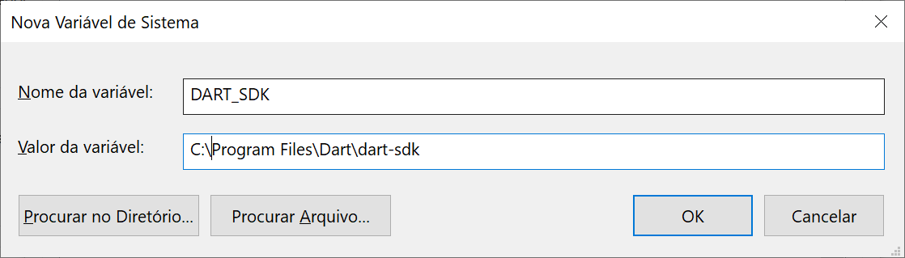
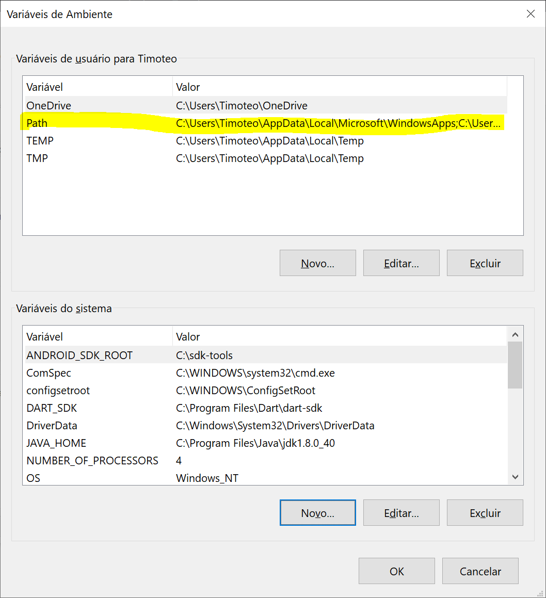
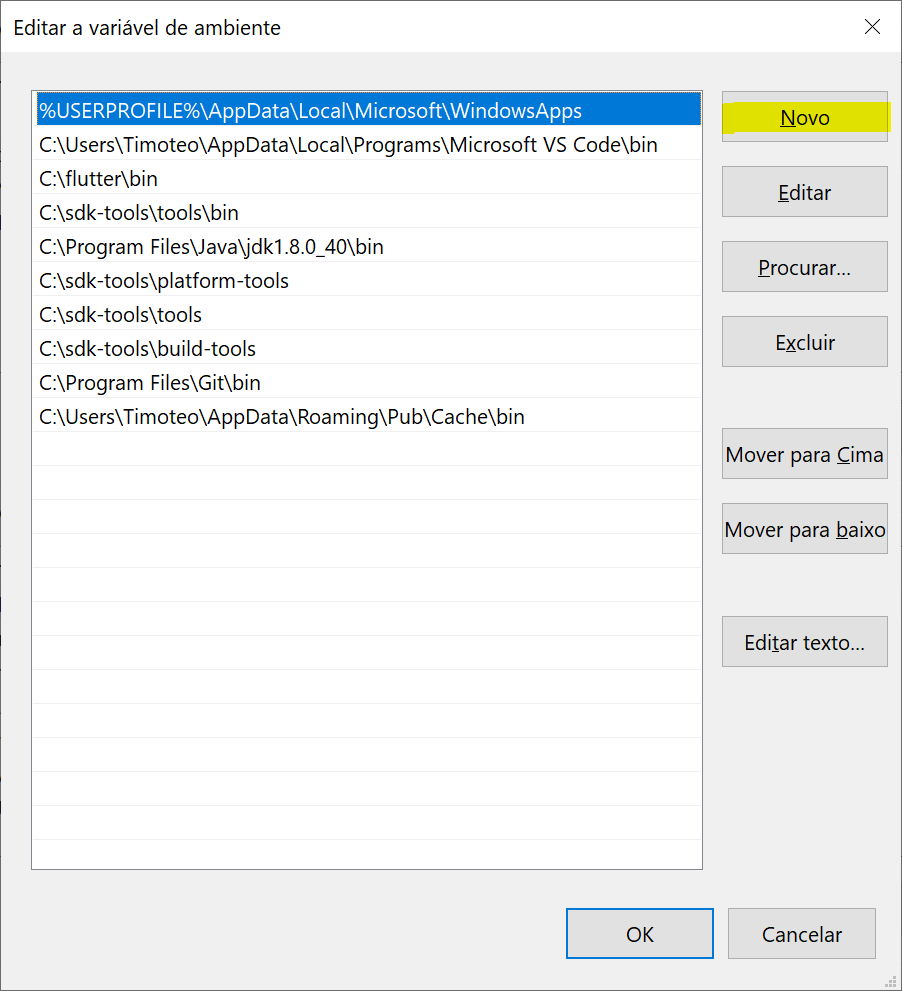
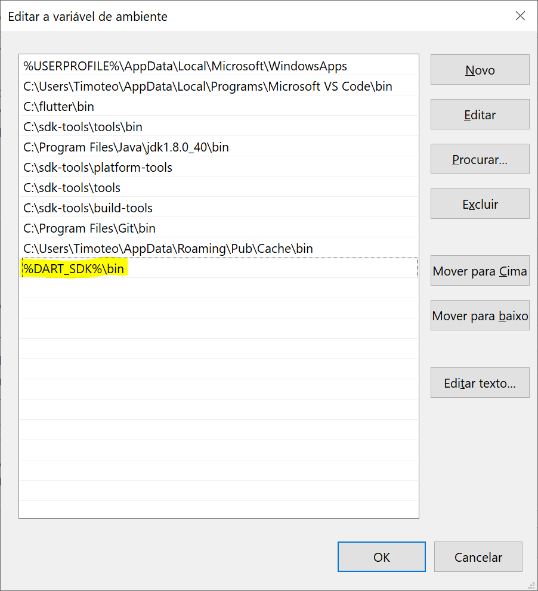

# Dart: primeiros passos com a linguagem

## Introdução ao curso de Dart

> `https://cursos.alura.com.br/course/dart-primeiro-passos`

- Descubra o que é o Dart.
- Instalar e executar código dart
- Configurar um ambiente de desenvolvimento para Dart
- Variáveis e condicionais
- Laços de repetição e break

## Conhecendo o Dart

### Introdução

Olá, tudo bem? Meu nome é Timóteo Holanda e serei o instrutor do curso de Dart na Alura.

Nesse curso aprenderemos o que é Dart e quais as características dele e por que aprendê-lo.

Veremos também como instalar o Dart em nossas máquinas e preparar um ambiente de desenvolvimento utilizando o Visual Studio Code e alguns plugins que facilitarão nosso trabalho nessa jornada que é programar com o Dart.

Como esse é um curso básico, caso já tenha conhecimento em programação ou programa em outras linguagens como o Java, Jacascript, C# e C++, por exemplo, nesse curso entenderemos a diferença de sintaxe da linguagem Dart para outras. Se estiver iniciando agora sua carreira na programação, o curso possui todo o conteúdo necessário para ter uma noção de como programar usando o Dart.

Veremos assuntos como variáveis, condicionais, variáveis booleanas, fluxos de controle, laços de repetição com fore com while, e aprenderemos a diferença entre esses dois.

Também veremos o break, uma forma de sair dos laços de repetição, e os laços de repetição alinhados, assim como a maneira de executar o Dart no nosso terminal e obter a saída do nosso programa.

Se tiver interesse em entender mais sobre Dart, nos vemos no curso.

### O que é Dart?

Antes de começar a colocar a mão na massa com o código, conversaremos sobre o que afinal de contas é o Dart e por que devemos ou queremos aprender a linguagem.

O Dart é uma linguagem de programação que nasceu em 2011 e foi desenvolvida pela famosa gigante da tecnologia Google. Ele foi construído desde o início pensando em desenvolvimento rápido e multiplataformas.

Geralmente, conhecemos o Dart por causa do Flutter, uma framework construída também pelo Google com o objetivo de dar suporte a desenvolvedores para desenvolverem aplicações nativas, tanto para Android quanto IOS. Com ele também é possível desenvolver aplicações web e Desktop.

Porém, precisamos evitar confundi-los.O Dart é uma linguagem criada para o desenvolvimento das aplicações. O Flutter é a ferramenta que utiliza essa linguagem, tornando possível o desenvolvimento de aplicações móveis. Logo, o Dart funciona sem o Flutter, mas o Flutter não funciona sem o Dart.

Se já tivermos facilidade com a linguagem C e seus filhos, como o C++, o Java, o C# e assim por diante, o aprendizado será facilitado, pois o Dart foi construído com a intenção de ser fácil para aqueles que já estão no ramo. Mas não há muitos problemas para quem está começando na programação, pois o pensamento de simplificar a linguagem tornou-a fácil o bastante para quem ainda não possui conhecimento na área.

Para os que já tem familiaridade com as linguagens voltadas para a web, tal qual o Javascript, será interessante saber que o Dart foi aprovado pela Associação Europeia de Fabricantes de Computadores, a ECMA. Esta é a mesma organização que ditou os padrões de linguagem do Javascript. Isso é importante porque os padrões aprovados para o Dart, o ECMA-408, segue os mesmos padrões que o do Javascript, o ECMA-262, o que influencia diretamente no funcionamento interno da linguagem.

Apesar das duas linguagens serem pouco parecidas, nesse aspecto são quase irmãs, a ponto do Dart possuir um compilador interno conhecido como dart2js que será próprio para traduzir o código para Javascript, a fim de rodá-lo facilmente em navegadores.

Essa pode parecer uma má ideia, pois poderíamos escrever o código em Javascript diretamente ao invés de usar o Dart e depois convertê-lo. Mas a tradução indica que o Google investiu em otimização interna e segundo dados da própria empresa o Dart compilado para Javascript pode ter uma performance 50% melhor do que o V8, o interpretador de Javascript mais potente atualmente e que curiosamente também foi gerado pelo Google.

Há gráficos para observar a diferença de performance entre os dois em testes bem conhecidos quando nos tratamos da comparação entre duas ou mais linguagens. O Delta Blue e o Richards são métricas de velocidade baseadas em um programa médio, porque foram feitas para simular atividades comuns que os programas farão no computador. Eles analisam quanto tempo cada programa desenvolvido leva para realizar as atividades. Ambos mostram um desempenho melhor do dart2js com relação ao V8.

Mas afinal, por que precisamos de uma nova linguagem de programação se podemos usar o Javascript programando para a web e o Java para dispositivos? A resposta é que já estava na hora de haver uma nova linguagem, pois o Dart não coleta funcionalidades redudantes através dos anos.

Tanto o Javascript quanto o Java, linguagem com as quais estamos comparando o Dart, foram lançadas em 1995. As duas possuem vestígios de desenvolvimento de mais de 20 anos. Isso quer dizer que a versão que podemos baixar e executar nesse momento possui códigos de mais de 20 anos, já que todas as novidades foram acopladas ao mesmo código ao longo do tempo.

O Dart foi criado em 2011 e desde sua fundação foi pensado para ter a melhor performance e abranger todos os dispositivos possíveis da atualidade, Esta é uma nova linguagem com um novo objetivo para alcançar um novo campo de desenvolvimento em um futuro próximo, tanto na web quanto em dispositivos móveis e Desktop.

### Quais Características?

A linguagem Dart foi planejada para atender a algumas características exigidas no mercado atual.

Quais são algumas destas características da linguagem de programação Dart?

- **Velocidade de execução.**
  - ***Correto! O Dart foi otimizado o bastante para oferecer uma execução comparável a linguagens muito utilizadas no mercado atual.***
- **Parecida com linguagens como C, C++, Java, Javascript etc.**
  - ***Correto! Desde sua concepção, o Dart se espelha em linguagens já existentes para facilitar a aprendizagem daqueles que já possuem conhecimentos nestas linguagens.***
- Executável exclusivamente no Windows.

### Diferentes sistemas

Fernando, um estudante da Alura, quer desenvolver uma aplicação de uso próprio utilizando o Dart.

Em quais destes sistemas Fernando poderá utilizar sua aplicação?

- **Em seu celular Android.**
  - ***Correto! O Dart possui a capacidade de ser executado diretamente do celular de Fernando.***
  - **Em seu computador.**
- ***Correto! No caso da execução de programas em Dart no computador, o Dart pode ser executado de forma nativa pelo terminal, ou compilado para um programa desktop comum.***
- Em seu website, de forma nativa.
- **Em seu website, compilado para Javascript.**
  - ***Correto! Por meio do compilador dart2js, é possível ter a mesma aplicação rodando em Javascript no website de Fernando.***

### Para saber mais: Compiladores

O Dart possui uma Máquina Virtual (o DartVM), semelhante à encontrada no Java (o JVM), que o permite executar código interpretado de forma rápida, utilizando um compilador chamado JIT (just-in-time, ou na hora certa), conhecido também como tradução dinâmica.

Além disso, o Dart tem embutido também um compilador AOT (ahead-of-time, ou antes do tempo), que permite a compilação do código-fonte para produzir aplicações nativas do dispositivo que esteja executando. Assim, é possível criar programas que utilizam 100% da capacidade de um computador, por exemplo.

Uma curiosidade: o sistema iOS não permite códigos traduzidos dinamicamente por questões de segurança, portanto, este é o compilador padrão utilizado na plataforma.

### O que aprendemos?

Vimos algumas características do Dart, como:

- É uma linguagem nova.
- É portável, podendo ser executado em vários dispositivos diferentes.
- É a linguagem que utilizada para desenvolvimento de aplicações do Flutter.
- Parecido com linguagens já existentes, como C++, Java, Javascript etc.
- Aprovado pelo ECMA, mesma instituição que ditou os padrões da linguagem Javascript.
- Possui um compilador interno capaz de compilar seu código para Javascript.
- É veloz e prático.

## Instalação e o primeiro programa

### Instalando o Dart

Hoje veremos como instalar tudo que precisamos para iniciar o desenvolvimento com a ferramenta que conhecemos como Dart.

O primeiro passo será acessar a internet com nosso navegador e acessar o site [dart.dev](https://dart.dev/) . Quem não souber Inglês não precisará se assustar, nós passaremos passo a passo o que for necessário para instalar o Dart em nossas máquinas. Para quem entende, também não se preocupe. A página dá a entender que o Dart é uma linguagem para construir aplicativos, mas dá muito foco à construção de interfaces gráficas. E o Dart realmente foi otimizado para uma boa construção de interfaces gráficas, mas começaremos com ele como uma linguagem de programação básica.

Clicaremos no botão "Get Dart". localizado na barra superior à direita da tela e uma nova página será aberta. Nela haverá instruções para a instalação de todas as versões do Dart. Numa parte da tela estará escrito "Install the Dart SDK". Este será o kit de desenvolvimento de software do Dart.

Diferentemente do Java, não precisaremos de uma JRE,. uma versão de ambiente da linguagem. O Dart só tem uma versão, portanto apenas uma precisará ser instalada por sistema operacional. Teremos a opção de instalação para Windows, Linux e Mac, usaremos o Windows devido às configurações da máquina.

Dentro da opção para Windows teremos ainda duas opções, a do Chocolatey, que pra quem ainda não conhece, é um gerenciador de pacote para Windows que tem algumas vantagens e desvantagens. Porém, a instalação por meio dele só será recomendável para os que já forem familiarizados com a ferramenta.

A segunda opção oferecida será a do guia de instalação. Bastará clicarmos no link e seremos transportados para outra página em que teremos ainda mais duas versões. Uma delas será a estável, a última lançada oficialmente pelos desenvolvedores do Dart. Todos as ferramentas agregadas à linguagem e que foram consideradas estáveis, sem bugs, estarão nessa versão.

Entretanto, se quiser acesso mais rápido às novas ferramentas sendo constantemente lançadas por quem desenvolve o Dart, é possível baixar a versão Dev, que permite o acesso a essas ferramentas que não existem na versão estável e não são consideradas prontas para a produção, então podem haver bugs, não sendo a mais recomendável.

As instruções de instalação para usuários do Linux e Mac também estarão na página do Dart Dev. No caso do Linux, para quem utiliza qualquer derivado do Debian será possível usar o segundo link, com uma forma semelhante a do Windows, baixar o arquivo e executá-lo no computador. Dessa forma, ainda será necessário rodar no terminal os dois comandos presentes nesta tela para instalar todos os binários do Dart e colocar o link para eles nas variáveis de ambiente da máquina.

Há ainda a opção de utilizá-lo pelo apt-get executando os quatro primeiros comandos da página e logo em seguida os dois seguintes para instalar a versão instável, ou outros três para a versão de desenvolvimento.

Voltando ao Mac, podemos rodar os dois comandos presentes no site no terminal do Mac para instalar no computador o Dart instável ou o comando seguinte para instalar o Dev.

Quanto a versão para Windows que baixamos, executaremos o arquivo, será aberto o prompt para executar como administrador, e aceitaremos os termos de contrato para continuar a instalação. Clicaremos em Install ao final do processo e baixaremos os dados.

Para verificar se o Dart estará instalado pelo Windows, podemos usar o "cmd". Abriremos o menu inicial, digitaremos "cmd" e teremos acesso ao terminal do computador, Para nos certificarmos de que o Dart estará instalado, abriremos o "cmd" e escreveremos Dart --version . Pressionaremos "Enter" e se virmos uma mensagem semelhante a Dart VM version: seguida do número da versão e data da instalação, isso significa que a instalação foi bem sucedida.

### Faça como eu fiz na aula

Após a instalação do Dart em sua máquina, é importante verificar se o programa foi configurado em suas variáveis de ambiente, para que possamos ter acesso a ele a partir do nosso terminal.

As variáveis de ambiente permitem com que programas instalados em seu computador tenham um ponto de partida universal, ou seja, se tivermos uma variável de ambiente para o programa do Dart instalado em nossos computadores, teremos acesso facilitado a ele em nosso terminal, dando flexibilidade na hora de construir nossos programas.

No Windows, você deve primeiramente saber o local de instalação do Dart, o local padrão de instalação é em:

```Shell
>C:\Program Files\Dart
```

ou

```Shell
>C:\Arquivos de Programas\Dart
```



Após verificar que a pasta Dart existe, devemos garantir que nossas variáveis de ambiente contenha a pasta com o Dart. Para isso, podemos buscar no Windows, utilizando o menu iniciar, pela frase “Editar as variáveis de ambiente do sistema”.



Clique na opção que apareceu e, na janela que foi aberta, devemos clicar em “Variáveis de ambiente”:



Nesta nova janela que foi aberta existem duas seções, as variáveis de usuário (para o usuário que você está usando em seu computador) e as variáveis do sistema (aquelas que ditam as variáveis do Windows como um todo). Vamos começar nos certificando de que a pasta de instalação do Dart esteja devidamente ativa como uma variável de sistema:



Caso a linha destacada em amarelo não exista, clique no botão “Novo”, logo abaixo da lista que aparece na imagem acima, e preencha da seguinte maneira:



Note que, no segundo campo, é necessário colocar o caminho da pasta onde está instalado o Dart em seu computador, seguido do \dart-sdk no final. Após confirmar apertando OK nesta janela, devemos agora nos certificar que nosso usuário tenha acesso a essa pasta também. Então, desta vez, clique em na opção Path da lista superior, e logo após em “Editar…”.



Nesta nova janela, vamos criar a variável de ambiente para nosso usuário, clicando em “Novo”:



Neste novo campo, no final da lista que apareceu, devemos digitar: 

```Shell
>%DART_SDK%\bin
```



Tudo pronto! Aperte OK e feche todas as janelas que abrimos. Reinicie seu computador, e suas variáveis de ambiente estarão prontas para serem usadas!

### Nosso primeiro programa

Agora vamos começar a fazer o grosso do nosso desenvolvimento. Nas próximas aulas falaremos de código. Mas antes de falar de código, temos que falar sobre algo muito importante: o ambiente de desenvolvimento.

O Dart não vem com nenhum ambiente padrão próprio para desenvolver. Há a liberdade para utilizar um editor de texto de preferência. Se buscarmos no Google por "IDE para Dart", a primeira página será um grande resumo de ferramentas que podem facilitar o desenvolvimento, no mesmo site que utilizamos para a instalação, Dart Dev, mas estaremos na sessão Tools, ferramentas em inglês.

As três principais ferramentas disponíveis que são recomendadas para o desenvolvimento com Dart são o Android Studio, o1 IntelliJ e o Visual Studio Code. O Android Studio e o IntelliJ são ferramentas muito parecidas, tanto que a página de instrução de ambas abordam praticamente o mesmo. O Android Studio é em suma uma modificação do IntelliJ para produzir aplicações específicas para Android.

O IntelliJ é uma IDE fantástica para desenvolvimento Java, mas tanto ele quanto o Android Studio oferecerão suporte para desenvolver em Dart também. Mais abaixo na mesma página, veremos instruções de como configurar o Dart para usar tais ferramentas.

Dentro de algum desses dois programas haverá uma barra de ferramentas na qual deve-se clicar em "Configurar > Plugins" para em seguida instalar a extensão que fornecerá suporte para trabalhar com Dart. Não utilizaremos esses softwares, entretanto.

Durante todo nosso curso, usaremos o Visual Studio Code, um editor de texto da Microsoft próprio para desenvolver em diversas linguagens. Na página dele há versões para o download adequadas a qualquer sistema operacional, Linux, Windows ou Mac. Fica a sugestão de baixar a ferramenta para acompanhar o curso.

Voltando ao site, teremos ainda alguns plugins disponíveis não-oficialmente para alguns editores de texto mantidos pela comunidade de desenvolvimento, como Emacs, Vim e Atom.

Se não quiser fazer essas instalações ainda, poderá utilizar o DartPad, ferramenta na qual o próprio navegador servirá como uma IDE, ou seja, bastará ter um navegador para trabalhar com o Dart. Para isso, bastará acessar o site [dartpad.dartlang.org](https://dartpad.dartlang.org/?). Ele funcionará no tablet, celular ou computador, qualquer aparelho em que acessarmos o navegador.

Do lado esquerdo da tela do DartPad escreveremos o código e do direito teremos a saída do console. pressionando o botão para executar. Mas não vamos iniciar nossa jornada com nenhuma das IDEs que mencionamos. Para mostrar que o código que estamos escrevendo não passa de texto, começaremos a escrevê-lo com o bloco de notas.

```Dart
void main() {
print("Ola, mundo");
}
```

Escrevemos o código-fonte do programa mais simples que existe. Ele imprimirá "Ola, mundo" na nossa tela. Digitamos "Olá" sem acento porque teremos um problema com extensões que discutiremos a seguir. Durante o curso vamos descobrir e nos aprofundar sobre o significado de cada um dos elementos no código. main() significa que esse será o ponto de partida do nosso programa, e é uma função. Uma função não é exclusivamente um ponto de partida, mas nesse caso ela será o ponto de partida. Nenhum programa do Dart funcionará sem a main().

O print() também será uma função. Logo após as funções sempre abriremos parênteses que deverão ser fechados em algum lugar. "Print" em Inglês significa "imprimir" e imprimiremos tudo que estiver entre parênteses e ente aspas, ou seja, "Ola, mundo". Terminamos essa linha com ponto e vírgula (:), diferentemente das demais. Veremos o porquê mais pra frente.

void denota algo vazio, que não possui nenhum retorno. Isso será melhor explicado quando aprendermos a respeito de funções e métodos. Estamos falando do programa mais básico existente em Dart. Escrevemos esse código no nosso bloco de notas e agora, para executá-lo, salvaremos o arquivo dando um nome genérico, como "programa", e deixaremos na nossa área de trabalho com a extensão ".txt" mesmo.

Como havíamos mencionado, usando o Windows, acessaremos "cmd" para o prompt de comando, e vamos executar o programa. Navegaremos para a área de trabalho em que o arquivo foi salvo, Desktop no nosso caso. Estando na pasta do usuário, digitaremos cd, uma abreviação de "change directory", do Inglês. "Mude o diretório" e escreveremos Desktop na sequência. Pressionando "Enter". abriremos essa pasta e com o comando dir serão mostrados todos os arquivos no interior.

Dentro da área de trabalho teremos o "programa.txt". Para executá-lo, chamaremos o programa do Dart no nosso terminal digitando dart programa.txt. Pressionaremos o "Enter" e a saída "Ola mundo" aparecerá na sequência.

Mas melhoraremos nosso programa a partir de agora, voltando ao bloco de notas. Iniciaremos toda linha de código que estiver dentro de uma função com um "Tab" para demonstrar hierarquia. Sendo assim, clicaremos no "Tab" antes do que estiver dentro da função main(), entre chaves, para o conteúdo ficar um pouco mais para a direita. Assim fica mais fácil visualizar o que está dentro ou fora da função. Quando fazemos programas mais complexos fica claro o quanto essa resolução é útil.

A única alteração efetuada foi o "Tab" antes do print(). Dessa vez salvaremos o programa como do Tipo "Todos os arquivos" em vez de "Documento de texto". Quanto ao nome, manteremos "programa", mas não usaremos a extensão ".txt" e sim ".dart". Essa será a extensão padrão para os nossos programas.

Voltando para o terminal, veremos que agora na área de trabalho temos um "programa.dart" além do "programa.txt" que ja tínhamos. Para executá-lo, iniciaremos digitando dart programa.dart. Executando, veremos que nada mudou, pois a alteração que fizemos do "Tab" não aparecerá no terminal.

### Para saber mais: código-fonte

O que você escreve é chamado de código-fonte, e possui esse nome porque contém os códigos (ou comandos) que seu computador utiliza como fonte para atingir um objetivo, seja imprimir uma linha de texto na tela, seja realizar cálculos mirabolantes. Um programa pode conter dezenas de milhares de linhas de código, e você provavelmente nunca vai atingir o limite. Portanto, saiba que sempre terá o espaço necessário para instruir seu computador a realizar qualquer tarefa que ele possa realizar.

### Impressão de texto

Jaqueline está aprendendo a linguagem Dart e quer escrever o seu primeiro programa. O programa vai escrever a frase “Olá, mundo! Meu nome é Jaqueline!” na tela.

Observe a linha abaixo:

```Dart
???(“Olá, mundo! Meu nome é Jaqueline!”);
```

Qual comando deve ser inserido no lugar indicado com ??? para que o programa cumpra o seu dever?

- main
- void
- **print**
  - ***Correto! O comando print é utilizado para imprimir texto na tela, e com ele Jaqueline consegue terminar seu programa.***

### O que aprendemos?

Nesta aula, aprendemos:

- Instalar o Dart.
- Executar o Dart no terminal com o comando dart.
- Que temos a liberdade de escrever nosso código-fonte no editor de texto de nossa preferência, ou até mesmo em nosso terminal.
- Instalar e configurar o Visual Studio Code.
- Que todo programa em Dart deve conter void main() {}.
- Que todos comandos devem terminar com ;.
- Que para imprimir algo na tela devemos utilizar o comando print().

## Tipos de variáveis

### Inteiros

Nas próximas aulas começaremos a tratar de tipos de variáveis, mais especificamente as que tratam de números.

Para nos manter organizados, criaremos uma pasta na área de trabalho chamada "sintaxe-variaveis-e-fluxo" em que manteremos tudo que for produzido durante o curso, como o código-fonte.

Abriremos o Visual Studio e antes de começar a escrever os códigos, ativaremos um plugin que facilitará nossa vida. Clicaremos no ícone de um quadrado na barra lateral esquerda da tela do programa referente às extensões, ou pressionaremos "Ctrl + Shift + X". Será aberta uma aba e na caixa de texto que aparecerá, digitaremos "Dart". A primeira opção da lista será a extensão do Dart para o Visual Studio. Então, clicaremos em "Install" para instalar essa opção e passar a tratar do código.

Como já criamos nossa pasta, clicaremos em "File > Open Folder" e abriremos nossa pasta criada, que ainda estará vazia. Pressionando "Ctrl + N", criaremos um novo arquivo. Começaremos a escrever um programa com a mesma estrutura inicial de "Ola, mundo". Mesmo sem termos escrito nada ainda, vamos salvar o programa e criar um nome para ele que será "testaVariaveisInteiras.dart".

Agora as palavras no código começarão a ficar coloridas porque cada uma terá um significado diferente. Usando o tema padrão do Visual Studio, as palavras amarelas serão funções. As azuis, serão palavras reservadas. As palavras reservadas são palavras que não podemos usar durante nosso programa se não for dentro de uma cadeia de caracteres.

Assim como começamos a fazer no primeiro programa, faremos um print() e escreveremos "Eu tenho 25 anos." dentro dos parênteses. A mensagem ficará vermelha e a função print() aparecerá amarela, assim como a main(). Chamaremos o conteúdo dentro das aspas de string. Então, com o plugin do Dart no Visual Studio, conseguiremos ter a noção visual dos elementos do código.

```Dart
void main() {
    print("Eu tenho 25 anos.");
}
```

Pressionaremos "Ctrl + S" para salvar o programa e para executar, abriremos o terminal, e entraremos na pasta em que ele estará digitando cd sintaxe-variaveis-e-fluxo\, mudando assim o diretório do terminal. Dentro da pasta teremos o programa que escreveremos. Para executá-lo, dart testaVariaveisInteiras.dart e pressionaremos "Enter". A saída será nossa mensagem "Eu tenho 25 anos."

Se uma pessoa tiver 25 anos hoje, ela não terá daqui a um ano. Porém, se o programa for executado daqui a um ano, a saída ainda será a mesma. È aí que começamos a utilizar variáveis no desenvolvimento. As variáveis são itens que podem ser modificados na execução, uma capacidade que queremos para a idade. Criaremos uma variável inteira.

Um número inteiro na matemática faz parte do conjunto de números que pode ser escrito sem a parte fracionada, seja ele positivo ou negativo . No Dart, o int indicará um valor inteiro, uma abreviação do inglês "integer". Escreveremos int idade; e o ponto e vírgula significará "acabei". Notaremos durante o desenvolvimento que a maioria das linhas terá

```Dart
void main() {
    int idade;
    print("Eu tenho 25 anos.");
}
```

Se salvarmos o programa e executarmos assim, nada acontecerá, porque só criamos a variável, mas não atribuímos nenhum valor a ela. Então, após a palavra idade colocaremos um sinal de igual e "25". O sinal de igual será o responsável por atribuir o valor "25" a variável idade. Assim, quando o programa estiver executando e chegar até a linha 2, dali em diante sempre que utilizarmos a variável idade ela terá esse valor, a não ser que seja modificada.

```Dart
void main() {
    int idade = 26;
    print("Eu tenho 25 anos.");
}
```

Salvaremos e executaremos novamente e nada será modificado porque não estamos utilizando essa variável. Se deixarmos o mouse em cima da variável, o próprio Visual Studio avisará isso com uma mensagem em Inglês. Criamos a variável e atribuímos valor a ela, mas nunca a utilizamos. Para isso, podemos excluir a mensagem declarando a idade e faremos o print com base apenas na variável. Colocaremos entre aspas e em vermelho por ser uma string.

```Dart
void main() {
    int idade = 26;
    print("idade");
}
```

Executando no terminal, o que nos será devolvida será a palavra "idade". Entretanto, não queríamos que aparecesse a idade literalmente, e sim o valor da variável. retiraremos as aspas, fazendo o print da variável print(idade).

Fazendo a execução novamente, aparecerá o valor "26" no terminal, pois o valor da variável idade mudou. Mas como podemos fazer para imprimir o valor naquela frase que tínhamos escrito?

O Dart apresenta facilita bastante nesse aspecto com relação a outras linguagens de programação, pois ele permite escrever a variável que queremos diretamente dentro de uma string. Se colocarmos $idadeo Dart entenderá que não esperamos a palavra "idade" e sim a variável.

```Dart
void main() {
    int idade = 26;
    print("Eu tenho $idade anos.");
}
```

Vamos salvar e executar o código e desta vez aparecerá a mensagem "Eu tenho 26 anos" no terminal. Podemos modificar o número para "27" também e utilizar o código daqui a 2 anos. Ao mesmo tempo, seria mais podemos usar operações matemáticas.

Vamos supor que numa família, a idade de um dos filhos é 25 anos. A do irmão, a idade do primeiro mais 2 anos, ou seja, dois anos mais velho. A idade do avô é igual a do primeiro rapaz mais a idade do irmão vezes 3, então são 3 vezes mais anos do que ambos os irmãos.

Para resolver esse problema, o valor da primeira idade será 25 anos. Criaremos a segunda variável, a idade idade do irmão 2 anos mais velho idade_irmao. Atribuiremos o valor idade + 2. Nós sabemos que o resultado da soma de 25 + 2 é 27, mas o programa ainda não. Quanto a idade_avo, será (idade + 2) * 3. Os parênteses serão necessários porque, assim como nas operações matemáticas, é efetuada primeiro a multiplicação, e devemos fazer a soma dentro dos parênteses primeiro. Por fim, imprimiremos as 3 idades.

```Dart
void main() {
    int idade = 25;
    int idade_irmao = idade + 2;
    int idade_avo = (idade + 2) * 3;
    print("Eu tenho $idade anos.");
    print("Meu irmao tem $idade_irmao anos.");
    print("Meu avo tem $idade_avo anos.");

}
```

Vamos salvar. Dessa vez teremos 3 variáveis. Vamos executar esse programa. Veremos a mensagem:

Eu tenho 25 anos.

Meu irmao tem 27 anos.

Meu avo tem 156 anos.

### Criando variáveis numéricas

Rafael precisa criar um programa capaz de fazer cálculos baseados na quantidade de dias que possuem em um ano, desconsiderando anos bissextos.

Quais das opções abaixo vão criar uma variável e atribuir a ela a quantidade de dias que um ano possui?

- **int dias = 365;**
  - ***Correto! A criação e atribuição de um valor a uma variável pode ser realizada na mesma linha, lembrando sempre terminar o comando com ;.***
- int dias dias = 365;
- void dias = 365;
- diasAno = 365;
- **int dias; dias = 365;**
  - ***Correto! A criação de uma variável pode ser em uma linha diferente da sua atribuição da, portanto, não é necessário atribuir um valor a uma variável na hora de sua criação.***

### Reais

Vamos continuar falando sobre números, mas agora falaremos sobre números com partes fracionais.

No programa que fizemos anteriormente, vimos os números inteiros, como 25,27 e 156. Criaremos um novo arquivo para trabalharmos com números reais. Vamos chamá-lo de "testaVariaveisReais.dart". Escreveremos nele a estrutura básica de um programa em Dart, void main().

Quando estivermos digitnado no Visual Studio, em diversos momentos surgirá uma janela com uma lista sugerindo o que podemos querer escrever, consequência de termos instalado a extensão do Dart. Digitando "prin...", por exemplo, nem precisaremos terminar de escrever a palavra e será sugerido a função print() como primeira opção. Pressionando o "Tab", a IDE colocará print(object) no código para nós, mesmo sem precisar terminar de escrever a palavra. Teremos que apagar o conteúdo dos parênteses.

Colocaremos aspas dentro de print() e completaremos com a mensagem Meu salário é de 1250.50". Devemos lembrar semore de colocar ponto e vírgula ao final de cada frase para o código funcionar.

```Dart
void main() {
    print("Meu salário é de 1250.50");
}
```

Vamos para o terminal e executaremos para saber se estará tudo certo. Digitaremos dart TestaVariaveisReais.dart, vamos rodar e será impressa a mensagem "Meu salário é de 1250.50".

Da mesma forma que tentamos escrever o programa anterior de forma mais dinâmica, tentaremos usar uma variável para poder alterar esse valor, já que daqui a um tempo o salário poderá mudar. Criaremos uma variáriável int para armazenar o salário.

```Dart
void main() {
    int salario = 1250.50;
    print("Meu salário é de 1250.50");
}
```

Vamos salvar e executar e veremos o erro gerado pela utilização do tipo errado. Haverá um texto em vermelho no terminal nos alertando sobre o erro de que um valor do tipo double não pode ser atribuído a uma variável do tipo int, em Inglês. Isso significa que o tipo que guarda valores inteiros não poderá guardar o número "1250.50", pois ele tem casas decimais.

Resolveremos isso usando outro tipo de variável, o tipodouble, feito especificamente para guardar um número inteiro com sua parte fracionada.

```Dart
void main() {
    double salario = 1250.50;
    print("Meu salário é de 1250.50");
}
```

Nem precisávamos ter executado o código para ver aquele erro. Modificando o tipo no código para int novamente, devido a instalação da extensão do Dart no VS Code, o valor "1250.50" ficará sublinhado em vermelho e se passarmos o mouse por cima dele, estará lá a mesma mensagem de erro do terminal.

Mudaremos o valor no print() apenas para $salario para fazer a impressão.

```Dart
void main() {
    double salario = 1250.50;
    print("Meu salário é de $salario"); 
}
```

Salvaremos o código e vamos para o terminal executá-lo. Será impresso: "Meu salário é de 1250.5". O "0" não aparecera mais, mas só quer dizer que o Dart está tentando minimizar os caracteres usados.

Vamos supor que no ano que vem o valor do salário dobrará. Para fazer o cálculo do salário no ano seguinte, bastará fazer uma multiplicação por 2. Também podemos usar as variáveis do tipo double em operações matemáticas normais.

```Dart
void main() {
    double salario = 1250.50 * 2;
    print("Meu salário é de $salario"); 
}
```

Salvaremos e executaremos e teremos a impressão do novo salário de 2501.0. Como o "0.5 * 2" será igual a 1, sem sobrar nenhuma fração,o programa acrescentará o ponto e o zero depois do resultado para simbolizar que a variável é do tipo double, ou seja, um valor fracionado. '

Nas operações matemáticas, o tipo double geralmente só será utilizado quando precisarmos fazer uma divisão. Por exemplo, se fizermos int divisao = 5/2 não dará certo, pois estaremos utilizando um valor inteiro para dividir um valor inteiro por outro, e o resultado seria um número real. Nossa IDE apontaria o mesmo erro anterior, de que um valor do tipo double não pode ser atribuído a uma variável int. Portanto, bastará alterarmos o tipo da variável para double.

Poderíamos pensar em utilizar variáveis double sempre, mas isso ficaria pesado, pois double, do Inglês, significa duplo justamente porque esse tipo utilizará duas vezes mais memória do computador para armazenar esse número, mesmo que utilizemos a variável para armazenar um número pequeno, pois o contador utilizará sempre a mesma quantidade de memória. Então, sempre que pudermos, utilizaremos o int para representar os números que não precisam ser quebrados.

Podemos fazer outras operações matemáticas a partir de então na mesma linha e isso não será um problema.

```Dart
void main() {
    double salario = 1250.50 * 2;
    print("Meu salário é de $salario"); 

    double divisao = 5/2 * 3;
}
```

Falaremos sobre inferência de tipo, algo que existe em quase todas as linguagens de programação. Sabemos que "5/2" é "2.50". "2.50 * 4" seria 10, um número inteiro. Se fizermos double divisao = 5/2 e int resultado = divisao * 4, apesar do resultado dessa operação ser um número inteiro, como estamos utilizando um valor fracionado, o da divisão, independentemente de quais forem os outros valores e o resultado, será necessário tipar como double, pois valores double não podem ser guardados como ints. Por fim, imprimiremos sem o uso de aspas, pois queremos o resultado diretamente.

```Dart
void main() {
    double salario = 1250.50 * 2;
    print("Meu salário é de $salario"); 

    double divisao = 5/2 * 3;
    double resultado = divisao * 4;
    print(resultado);
}
```

De cabeça, já sabemos que o resultado será 10, mas queremos vê-lo impresso. No terminal, após salvar e executar o programa, obteremos "10.0".

### Identificando tipos

Larissa estava ajudando seu amigo Lucas em seu programa feito em Dart e observa o seguinte código:

  ??? primeiro_numero = 42;
  ??? segundo_numero = primeiro_numero / 4;
  ??? terceiro_numero = primeiro_numero * 2;
  ??? quarto_numero = terceiro_numero - segundo_numero;COPIAR CÓDIGO
Lucas não conseguiu de imediato identificar quais os tipos de variáveis que devem ser atribuídos no código. Mas Larissa imediatamente conseguiu enxergar quais são eles.

Qual das opções abaixo contém os tipos que farão esse programa executar sem problemas?

- A

```Dart
int primeiro_numero 
double segundo_numero 
double terceiro_numero 
String quarto_numero   
```

- B

```Dart
double primeiro_numero 
double segundo_numero 
int terceiro_numero 
double quarto_numero   
```

- C

```Dart
int primeiro_numero 
int segundo_numero 
int terceiro_numero 
int quarto_numero   
```

- D

```Dart
double primeiro_numero 
int segundo_numero 
double terceiro_numero 
int quarto_numero   
```

- **F**

```Dart
int primeiro_numero 
double segundo_numero 
int terceiro_numero 
double quarto_numero   
```

***Correto! Apenas a divisão entre dois tipos inteiros gera uma variável do tipo double, mas quando usamos uma variável do tipo double em qualquer operação matemática, o resultado será outro tipo double.***

### Strings

Já ouvimos falar sobre variáveis do tipo inteiro, números sem partes fracionadas, e sobre variáveis do tipo double, as referentes a números reais. Agora aprenderemos como armazenar texto no nosso programa de Dart.

Vamos criar um arquivo no VS Code e o salvaremos com o nome de "testaVariaveisString.dart" e já escreveremos a estrutura básica do programa, void main() {}. Para os programadores que já conhecem o Java e C, provavelmente já conhecem o char. Nessas linguagens, esse era um tipo de variável que armazenava apenas um caractere. Para armazenar um texto, seria necessário um vetor de caracteres.

Um vetor de caracteres são várias variáveis sequenciadas e cada uma delas armazena uma letra do seu texto. No Dart isso não será necessário, pois mão existe uma variável de caractere. Existe o string que já é uma cadeia de caracteres e funciona da mesma forma que estávamos utilizando na função print() como já fizemos anteriormente abrindo aspas para escrever frases.

```Dart
void main() {
    String texto = "Alura - Cursos Online de Tecnologia";
}
```

Assim, teremos criado nossa primeira variável que armazena uma cadeia de caracteres. Algumas linguagens de programação não aceitam a criação de uma cadeia com aspas simples, apenas com aspas duplas. O Dart não faz essa diferenciação, mas as aspas são necessárias.

Se escrevermos String texto = Alura - Cursos Online de Tecnologia, aspas, toda a frase será sublinhada em vermelho indicando o erro, pois essa não será uma String conforme o editor de texto estará esperando de acordo com a linguagem.

Para imprimir, poderemos utilizar o print() diretamente com a variável texto dentro ou ainda podemos usar as aspas com a variável texto dentro e o cifrão na frente.

```Dart
void main() {
    String texto = "Alura - Cursos Online de Tecnologia";
    print(texto);

    print("$texto");
}
```

Vamos salvar o código e executar no terminal com dart testaVariaveisString. As duas linhas impressas serão iguais porque realmente não há diferença ente as duas formas. Se for para imprimir apenas a string, será mais válido escrever a variável diretamente pela praticidade. Por enquanto, aparemos a outra opção, do cifrão.

Antes da variável de texto, criaremos uma variável int e a chamaremos de ano.Atribuiremos a ela o valor de "2013". Colocaremos o valor ano dentro da string, complementando a frase e usando o cifrão: "Alura - Cursos Online de Tecnologia desde $ano".

```Dart
void main() {
    int ano = 2013;
    String texto = "Alura - Cursos Online de Tecnologia desde $ano ";

    print(texto);

}
```

Salvaremos o código, voltaremos ao terminal e executaremos. Veremos a impressão de "Cursos Online de Tecnologia desde 2013". Mas o que acontecerá se modificarmos o valor desse ano depois de termos declarado a variável de texto?

Na quarta linha do código atribuiremos à variável ano o valor de ano + 6. Então, se dentro de ano há 2013, somado a 6 será 2019. Veremos qual será o resultado no terminal.

```Dart
void main() {
    int ano = 2013;
    String texto = "Alura - Cursos Online de Tecnologia desde $ano ";
    ano = ano + 6;

    print(texto);

}
```

Salvando e executando, a saída será da frase com o ano de 2013, mesmo repetindo o resultado. Se fizermos print(ano)antes de print(texto), o valor do primeiro print será 2019, mas o segundo trará 2013.

Isso acontece porque quando criamos uma variável e armazenamos outra variável dentro dela utilizando o cifrão, será armazenado dentro dessa string sempre o valor atual. Portanto, para atualizar o ano, será imprescindível atualizar o texto.

```Dart
void main() {
    int ano = 2013;
    String texto = "Alura - Cursos Online de Tecnologia desde $ano ";
    ano = ano + 6;
    texto = "Alura - Cursos Online de Tecnologia desde $ano ";

    print(ano);
    print(texto);
}
```

Vamos salvar e executar novamente o programa e desta vez leremos "Alura - Cursos Online de Tecnologia desde 2019 ".

Também podemos evitar que o engano ocorra não colocando o ano diretamente na string, mas utilizando a outra forma que já aprendemos de fazer a impressão. Imprimiremos primeiro a variável $texto e em seguida o $ano entre as aspas.

Assim, poderemos alterar o ano no código quantas vezes for necessário. Dessa forma, conseguiremos imprimir sempre o texto e o ano mais atuais.

```Dart
void main() {
    int ano = 2013;
    String texto = "Alura - Cursos Online de Tecnologia desde $ano ";
    ano = ano + 6;


    print("$texto $ano");

}
```

Agora executaremos e teremos conseguido a impressão correta da frase "Alura - Cursos Online de Tecnologia desde 2019".

### Juntando Strings

Luísa quer criar uma cadeia de strings que precisam ser impressas de forma sequencial. Ela criou as seguintes variáveis:

```Dart
String texto_inicio = ‘Olá, meu nome é ’;
String endereco = ‘rua Ovomaltine, número 65‘;
String nome = ‘Luísa’;
String texto_meio = ‘ eu tenho 22 anos’;
String texto_final = ‘ e moro na ’;COPIAR CÓDIGO
```

Quais das seguintes opções vão imprimir a frase na ordem correta?

- **print(texto_inicio+nome+texto_meio+texto_final+endereco);**
  - ***Correto! O Dart também aceita a concatenação de Strings por meio do operador matemático +.***
- **print(‘$texto_inicio $nome $texto_meio $texto_final $endereco’);**
  - ***Correto! Com o Dart, você pode imprimir várias variáveis dentro de uma String utilizando o símbolo $ antes do nome de uma variável.***
- print(‘$texto_inicio $endereco $texto_meio $nome $texto_final’);

### Misturando int e double

Durante as aulas, aprendemos que operações realizadas entre valores inteiros e valores double resultam em resultados do tipo double. Isso é comum, pois o tipo inteiro requer apenas 4 bytes, enquanto uma variável do tipo double utiliza um grande espaço de 8 bytes.

O motivo de o tipo double precisar de tanto espaço assim é porque um número em sua representação real pode conter várias casas de precisão após a vírgula, portanto, o valor 10.10 ocuparia o mesmo espaço que 10.1000000000000000000, apesar de serem o mesmo número.

E por que uma multiplicação como 2.5 * 4, que resulta em 10, não é armazenada em um tipo inteiro? Pense da seguinte maneira, o número 4 vive em uma casa pequena, pois consegue se encaixar bem na sua casinha, já que ele não possui uma parte fracionada; enquanto o número 2.5 vive em uma casa bem grande, pois precisa armazenar toda a sua parte fracionária. Caso você deseje misturar os dois, eles vão eventualmente precisar ocupar o mesmo espaço. Então, já que 2.5 não cabe na casa de 4, o 4 vai ter que caber na casa do 2.5, efetivamente tornando o tamanho da casa dos dois números em uma do mesmo tamanho que a do 2.5.

### Convertendo tipos

Você sabia que é possível converter o valor de uma variável para outro tipo?

Enquanto não podemos alterar o tipo da variável em si, podemos armazenar o valor dela em outra variável com tipo diferente, e dependendo da variável final não teremos perda de informação nenhuma!

Observe o código abaixo:

```Dart
double pi = 3.141592;

int pi_inteiro = pi.toInt();
```

Ao executar esses dois trechos de código, o valor a ser armazenado na variável pi_inteiro será apenas a parte inteira do valor da variável pi, ou seja, apenas o número 3, sem a parte fracionária do valor de pi, pois ela não cabe no tipo de variável inteiro.

Essa conversão também funciona para a ordem inversa de variáveis:

```Dart
int dezena = 100;

double dezena_double = dezena.toDouble();
```

Desta vez, o número 100 é armazenado como 100.0 na variável do tipo double.

Int e Double podem converter um valor numérico contido em uma variável do tipo String também, mas devemos fazer algo um pouco diferente:

```Dart
String string_inteiro = “13”;

String string_double = “13.14”;


int numero_inteiro = int.parse(string_inteiro);

double numero_double = double.parse(string_double);
```

Resumidamente, se você deseja transformar um valor de um tipo numérico para outro tipo numérico, você deve utilizar um dos dois:

```Dart
nome_da_variável.toDouble();
// Converte para double

nome_da_variável.toInt();
// Converte para int
```

Agora, se você quer transformar um número de uma String para um tipo numérico, deve utilizar:

```Dart
double.parse(nome_da_variável);
// Converte para double

int.parse(nome_da_variável);
// Converte para int
```

Qualquer dúvida, acesse nosso fórum!

### Tipagem de variáveis

Já falamos de números inteiros, de números reais e de texto. Agora falaremos sobre uma funcionalidade do Dart muito interessante para quem vem do Javascript.

Quem está começando a programar agora talvez tenha alguma dificuldade em aprender a respeito da tipagem de variáveis, ou qual será o tipo das variáveis quando formos criá-las.

Criaremos um novo arquivo que salvaremos como "testaVariaveisDinamicas.dart". Escreveremos a estrutura padrão do programa em Dart. O Dart é uma linguagem de programação conhecida por ser fortemente tipada. Sendo assim, para criar uma variável devemos indicar o tipo dela para que o Dart possa identificá-lo.

Quando criamos uma variável de número inteiro, é necessário declarar isso, por exemplo, int idade = 25, e durante todo o programa "25" assumirá o valor de um número inteiro. O mesmo valerá para o double. Para fazer double pi = 3.1415 precisamos dizer no código-fonte que a variável pi será do tipo double.

O mesmo valerá para as Strings, para guardar um texto teremos que dizer para o Dart teremos uma variável String. Para imprimir, usaremos a função print(). Só passaremos a variável texto para ser impressa diretamente.

```Dart
void main() {
    int idade = 25;
    double pi = 3.1415;
    String texto = "Eu tenho $idade anos e o valor de pi é $pi";

    print(texto);

}
```

Executaremos o programa no terminal com dart testaVariaveisDinamicas.dart e o resultado será "Eu tenho 25 anos e o valor de pi é 3.1415".

Além do Dart ser fortemente tipado, ele também adotou a tipagem dinâmica. Isso significa que o Dart tem a capacidade de entender o tipo de cada variável fazendo a verificação deles antes mesmo da execução terminar.

Substituiremos o int pela palavra var,pois usaremos o var para dizer ao Dart que não importará o tipo dessa variável, bastará guardar o valor. Antes do programa ser executado, todos os var serão verificados e será observado o que estará do lado das atribuições, ou seja, o valor das variáveis. No caso de var idade = 25,o valor será um número inteiro, então ele trocará por int.

Se trocarmos o double pelo var ocorrerá o mesmo. Antes do programa ser executado o Dart passará por todas as variáveis e identificará que quando damos valor para a variável var pi = 3.1415 há um número real, substituindo o var por um double. O mesmo aconteceria para String.

No VS Code, se deixarmos o mouse em cima de uma variável na qual utilizamos var o tipo da variável será identificado sem a necessidade de fazer a execução.

```Dart
void main() {
    var idade = 25;
    var pi = 3.1415;
    var texto = "Eu tenho $idade anos e o valor de pi é $pi";

    print(texto);

}
```

Salvaremos o código,voltaremos no terminal e executaremos novamente. A execução ocorrerá normalmente e o programa terá identificado normalmente o tipo de cada variável, mesmo nós não tendo declarado nenhu tipo.

No entanto, apesar de não termos nos preocupado com a declaração, não poderemos modificá-lo depois. Digamos que declaramos var idade = 25, mas na linha seguinte, vamos querer mudar a idade para idade = 25.5. O valor será sublinhado em vermelho e a IDE nos alertará se colocarmos o cursor do mouse sobre 25.5 que o valor double não pode ser atribuído a uma variável de tipo inteiro, pois na primeira atribuição, o valor era do tipo inteiro. Então, a modificação não funcionará.

```Dart
void main() {
    var idade = 25;
    idade = 25.5;

    print(idade);

}
```

Tentaremos salvar e executar, mas aparecerá o mesmo erro no nosso terminal, porque o tipo var não existe de verdade, ele será modificado para int antes de tentarmos executar o programa.

Entretanto temos uma opção muito interessante no Dart, o tipo dinâmico. Mudaremos o tipo var da idade para dynamic. Notaremos que com essa substituição, o sublinhado vermelho referente ao erro em idade = 25.5 sumirá, porque o dynamic será um tipo que permitirá a modificação do valor da variável, assim como alterar o próprio tipo. Se passarmos o mouse por cima da mesma variável agora ela não terá mais uma diversidade de tipos, apenas "dynamic".

O tipo dessa variável poderá mudar durante a execução do programa. Colocaremos uma frase para a idade.

```Dart
void main() {
    var idade = 25;
    idade = 25.5;
    idade = "Eu tenho $idade";
    print(idade);

}
```

Salvaremos e vamos executar. Leremos "Eu tenho 25.5" Então nessa primeira linha, a variável assumia um valor inteiro, 25. Na segunda, m double, 25.5. Na terceira, o valor de uma string, Por fim, imprimimos tudo.

Alguns podem pensar que os dynamics serão muito úteis e podíamos utilizar o programa utilizando apenas eles. E de fato. serão interessantes, mas há um custo computacional na memória para essa compreensão de qual o tipo da variável. Ter um pequeno conjunto de dynamics não tornará o programa muito lento, mas um programa utilizando apenas essas variáveis exigiria muito empenho para reconhecer todos os tipos usados, sendo considerada uma má prática pela comunidade.

É recomendável usar var, que não tem custo computacional algum, apesar de também ter valor escrever diretamente o tipo, principalmente para os que estiverem mais focados na utilização do programa e no quão rápido ele executará.

### Faça como eu fiz na aula

No Dart, temos a opção de criar variáveis de forma explícita, dizendo exatamente o tipo da variável que queremos, por exemplo, int, double e String, mas também temos a opção de deixar esse trabalho pesado para o Dart, utilizando das palavras reservadas var ou dynamic.

Pensando nisso, vamos criar um programa que escreva o valor de pi e sua idade na frase “Eu tenho ??? anos e o valor de pi é ???”. Armazenaremos todas essas variáveis de forma dinâmica.

Começamos escrevendo a estrutura básica de um programa em Dart:

```Dart
void main() {

}
```

Então adicionamos as variáveis pi, idade e texto.

```Dart
void main() {
    var idade = 25;
    var pi = 3.1415;
    var texto = ‘Eu tenho $idade anos e o valor de pi é $pi’;
}
```

Podemos agora imprimir essa frase utilizando print():

```Dart
void main() {
    var idade = 25;
    var pi = 3.1415;
    var texto = ‘Eu tenho $idade anos e o valor de pi é $pi’;
    print(texto);
}
```

### O que aprendemos?

Nesta aula, vimos como:

- Criar variáveis numéricas do tipo inteiro com int.
- Criar variáveis numéricas do tipo real com double.
- Criar variáveis que guardam texto com String.
- Criar variáveis de forma dinâmica e que não podem alterar seu tipo durante a execução do programa, usando var.
- Criar variáveis de forma dinâmica e que podem alterar seu tipo durante a execução do programa, usando dynamic.
- Inserir valores numéricos dentro de variáveis do tipo String.
- Converter tipos diferentes.

## Condicionais

### Condicional if

Já aprendemos sobre os tipos de variáveis mais importantes que o Dart nos oferece e começaremos a criar um sistema básico para nos aprofundar nos sistemas em Dart.

O Dart. como a maioria das linguagens de programação, nos oferece a ferramenta das condicionais, e começaremos a entendê-las fazendo um sistema de ingressos para o Cine Alura.

Começaremos criando um novo arquivo que deixaremos salvo como "testaCondicionais.dart".

O que torna um programa útil é a capacidade dele de realizar operações diferente que dependem de variáveis que ele lê. Escreveremos a estrutura básica de um programa e imprimiremos algo na tela, além de criar uma variável.

```Dart
void main () {
    print("Testando condicionais");
    int idade = 25;
}
```

Sabemos que salvando esse código para rodar esse programa nada acontecerá pois não impusemos nenhuma ação ao programa. Ele só imprimirá uma linha e atribuirá valor a uma variável.

Mas no Cine Alura, a ideia será só permitir que maiores de idade assistam a alguns filmes. Minha idade é 25, sou maior de idade, mas o computador não entende isso ainda. Devemos dizer para ele apenas o que ele poderá entender.

Então, vamos escrever uma nova palavra reservada, if, completando o programa.

```Dart
void main () {
    print("Testando condicionais");
    int idade = 25;

    if(idade > 18) {
        print("Você é maior de idade, pode entrar!");
    }
}
```

A palavra if, em inglês, significa "Se", ou seja, uma condição. Se isso acontecer, faremos aquilo. Nesse caso, se a idade for maior que 18, o programa imprimirá a frase determinada.

Então, trataremos de alguns operadores lógicos. Assim como faremos em cima do if por meio dos comentários, podemos escrever algumas notas, os comentários, que no Dart serão permitidos por meio das duas barras no início da linha (//). Os comentários podem ser usados para deixar mensagens que deverão ser relembradas futuramente ou para explicar partes do código para outras pessoas que tiverem acesso a ele.

Portanto, o símbolo "<" significa menor que e ">" maior que. Para verificar se um número será igual ao outro, não poderemos utilizar apenas o sinal de igual. Utilizando apenas o sinal de igual, faremos uma atribuição. Por isso será necessário usar dois para simbolizar igual, ou seja, "==".Para verificar se um valor é menor ou igual, "<=", maior ou igual, ">=".

Dentro de if, se quisemos fazer qualquer uma dessas comparações, teremos que usar o símbolo que representa essa comparação.

```Dart
void main () {
    print("Testando condicionais");
    int idade = 25;

    // < significa menor que
    // > significa maior que
    // == significa igual a
    // <= significa menor igual
    // >= significa maior igual

    if(idade > 18) {
        print("Você é maior de idade, pode entrar!");
    }
}
```

Vamos salvar e executar esse programa no terminal com dart testaCondicionais.dart. Leremos as mensagens:

```Dart
Testando condicionais

Você é maior de idade, pode entrar!
```

A impressão foi executada porque o valor que atribuímos para a variável de idade é maior do que 18. Mas o que aconteceria se mudássemos esse número para um valor menor do que 18, como int idade = 17 ?

Salvando e executando o programa novamente, de volta ao terminal, dessa vez só será impresso "Testando condicionais" e mais nada. Quando a frase não é impressa é porque a condição não correspondeu a do nosso if(idade > 18).

Escreveremos uma mensagem para avisar quando menores de idade tentarem entrar. Apagaremos os comentários do código, pois já demonstramos para que eles servem.

```Dart
void main () {
    print("Testando condicionais");
    int idade = 17;


    if(idade > 18) {
        print("Você é maior de idade, pode entrar!");
        print("Você é menor de idade, não pode entrar!");
    }
}
```

Esse método funcionará quando salvarmos e executarmos. O problema é que se quisermos alterar a variável de idade para 25 novamente, quando rodarmos o programa no terminal mais uma vez, ambas as mensagens serão impressas porque não estabelecemos uma condicional para a segunda mensagem aparecer. Sem uma condicional, a mensagem aparecerá em qualquer execução.

Isso poderá ser resolvido porque o Dart não nos oferece apenas o if, que representa o "se", mas também o else, que significará "senão". Colocando o else logo depois da chave que fecha o if e abrindo chaves após ele, colocaremos o print() da segunda mensagem. Então, determinaremos que se a idade for maior do que 18, será impressa uma coisa, senão, a frase será outra.

Como essa é uma questão binária, de "sim" ou "não", ou a idade é maior/menor do que 18 anos ou não, esse método funcionará muito bem.

```Dart
void main () {
    print("Testando condicionais");
    int idade = 25;


    if(idade > 18) {
        print("Você é maior de idade, pode entrar!");
    }
    else {
    print("Você é menor de idade, não pode entrar!");
    }
}
```

Vamos salvar e executar e dessa vez veremos apenas uma mensagem dizendo que sou maior de idade.Alteraremos a idade para 127 anos de novo int idade = 17.

Executaremos e a mensagem se alterará para a direcionada aos menores de idade.

Para finalizar, trataremos de mais uma questão. E o número 18, será considerado maior de idade? Ele deve ser, pois pessoas de 18 anos são maiores de idade.

Porém, infelizmente alterando a idade para 18 e executando o programa, o Dart não considerará. Para que ele compreenda que se alguém tem 18 deve ter a entrada permitida, precisaremos usar o símbolo de maior ou igual.

```Dart
void main () {
    print("Testando condicionais");
    int idade = 25;


    if(idade >= 18) {
        print("Você é maior de idade, pode entrar!");
    }
    else {
    print("Você é menor de idade, não pode entrar!");
    }
}
```

Essas são informações básicas que usaremos em todas as próximas aulas.

### Faça como eu fiz na aula

Vamos praticar o uso da condicional if.

Começamos criando nossa estrutura básica para todos os programas de Dart:

```Dart
void main() {

}
```

O programa que vamos fazer nesta atividade é o CineAlura, um programa que vai ler a idade de uma pessoa e dizer se ela pode entrar ou não para assistir ao filme, e nesse caso específico, o filme possui uma restrição de idade de 18 anos. Ou seja, menores de idade não podem assistir.

Para dar continuidade, vamos criar uma variável chamada idade do tipo inteiro, nela vamos armazenar a idade da pessoa. Vamos usar o valor 19 como exemplo.

```Dart
void main() {
    int idade = 19;
}
```

Em seguida, nós devemos fazer a verificação, uma simples comparação para discernir o valor da variável idade do número 18, que é a idade mínima para assistir ao filme. Para realizar isso, vamos utilizar o if, que é um comando do Dart que vai fazer essa comparação dentro de nosso programa.

If em inglês significa a palavra se, no mesmo contexto de “se você está feliz, bata palmas!”. Temos uma condição para batermos palmas nessa frase, e a condição é “estar feliz”. No CineAlura não vai ser diferente. Se quisermos que a pessoa entre no cinema, a condição será a idade dela ser maior que 18 anos, mas se ela não for maior de idade, ela não poderá entrar.

Na prática, em nosso código, isso se traduz da seguinte maneira:

```Dart
void main() {
    int idade = 19;
    if ( idade >= 18 ) {
        print(“Você é maior de idade, pode entrar!”);
    } else {
        print(“Você é menor de idade, não pode entrar!”);
    }    
}
```

O else depois do if indica o que fazer caso a idade não seja maior que 18. Em inglês, else significa “se não”.

### Simplificando o if

O if pode ser escrito de forma simplificada, e isto é uma prática comum na programação Dart. Observe o if a seguir, nele verificamos se o valor da variável numero é maior que 10.

```Dart
void main() {
    int numero = 11;

    if( numero > 10 ) {
        print(‘O número é maior que 10.’);
    } else {
        print(‘O número não é maior que 10.’);
    }    
}
```

Notem que precisamos de 5 linhas, um if e um else, para realizar essa verificação. No entanto, o Dart nos provê uma forma de fazer essa verificação de maneira muito mais rápida de se escrever.

Primeiro, veja esta frase:

```Dart
O número é maior que 10? Se sim, faça X, se não, faça Y.
```

Essa pergunta resume nosso if com perfeição, pois é justamente isso que estamos perguntando ao nosso computador. Seguimos então com um comando: se a resposta da pergunta for verdadeira, devemos fazer uma coisa, mas se a resposta da pergunta for falsa, devemos fazer outra coisa.

Podemos traduzir essa frase para nosso código da seguinte maneira:

```Dart
número > 10 ? X : Y;
```

Percebe que a frase mantém o sentido, mas de forma reduzida? A pergunta vêm antes do ponto de interrogação, e nossas opções vêm logo depois.

Vamos reduzir o código que já tínhamos escrito, mas dessa vez utilizando essa nova forma de escrever:

```Dart
void main() {
    int numero = 11;

    numero > 10 ? print("O número é maior que 10.") : print("O número não é maior que 10.");    


}
```

Observação: Não é necessário o ponto e vírgula (;) depois o comando que vêm após o ponto de interrogação, pois precisamos colocá-lo apenas no final de todo o conjunto.

Reparem também que, pelo tamanho da linha que escrevemos, a frase parece muito extensa. Podemos organizar nosso código para facilitar a sua leitura:

```Dart
void main() {
    int numero = 11;

    numero > 10 
    ? print("O número é maior que 10.") 
    : print("O número não é maior que 10.");    
}
```

O nome dessa simplificação é Operação ternária.

### Categorizando altura

Danilo quer fazer um programa para categorizar a altura de pessoas. O programa deve receber a altura de uma pessoa em centímetros e retornar uma das 4 opções:

- Se a altura da pessoa for menor que 150 centímetros, ela é pequena.
- Se a altura da pessoa for maior ou igual a 150 centímetros e menor que 175 centímetros, ela é média.
- Se a altura da pessoa for maior ou igual a 175 centímetros e menor que 195 centímetros, ela é grande.
- Se a altura da pessoa for maior que 195 centímetros, ela é gigante.

Danilo começou o programa escrevendo o seguinte código:

```Dart
void main() {

    int altura = 178;

    // ifs aqui

}
```

Ajude Danilo a implementar as regras do programa utilizando condicionais.

A seguir, uma possível implementação do problema: 

```Dart
void main() {
  int altura = 178;
  if (altura < 150) {
    print('Essa pessoa é pequena.');
  } else if (altura > 195) {
    print('Essa pessoa é gigante.');
  } else if (altura >= 150 && altura < 175) {
    print('Essa pessoa é média.');
  } else {
    print('Essa pessoa é grande.');
  }
}
```

### Condicionais Booleanas

Agora falaremos de variáveis booleanas. Elas ficaram para depois de outras variáveis como as int, double e etc porque elas são as bases quando tratamos de condicionais.

Quando vamos fazer uma condicional como fizemos, o compilador do Dart interpretará o que escrevemos como verdadeiro ou falso. Voltando ao exemplo que já fizemos:

```Dart
void main () {
    print("Testando condicionais");
    int idade = 25;

    if(idade >= 18) {
    print("Você é maior de idade, pode entrar!");
    }
    else {
        print("Você é menor de idade, não pode entrar!");
    }
}
```

25 será maior ou igual a 18, portanto essa verificação será verdadeira e entraremos no if. Se não fosse maior ou igual, isso seria falso e entraríamos no else.

Vamos expandir um pouco esse conceito, e para isso criaremos um arquivo que salvaremos como "testaCondicionais2.dart". Nele escreveremos a estrutura básica e deixaremos a idade. Escreveremos basicamente o mesmo programa usando outra forma.

Usaremos agora outro tipo de variável, bool, outra palavra reservada oferecida pelo Dart, dessa vez exclusiva para guardar variáveis que sejam verdadeiras ou falsas.

A bool maior_idade será igual a condicional que colocamos no último programa, idade >=18. Assim, estaremos guardando o resultado da operação na variável, de modo semelhante a se fizéssemos int soma = 2+2, mas costumamos pensar no operador maior ou igual como uma comparação, enquanto "2 + 2" será uma operação matemática básica de soma.

Assim, estamos guardando o valor de uma expressão que poderá ser verdadeiro ou falso. Se 24 for maior ou igual a 18, guardaremos que isso é verdadeiro dentro da variável. Caso contrário, que é falso. O Dart guardará sempre em Inglês, como "true" (verdadeiro) ou "false'" (falso). Então, um tipo booleano poderá sempre ser um dos dois valores.

Dessa vez escreveremos se uma pessoa é maior ou menor de idade com a condicional e os print()s.

```Dart
void main () {
    print("Testando condicionais");

    int idade = 25;

    bool maior_idade = idade >= 18;

    if(maior_idade) {
        print("Você pode entrar!");
    }
    else {
        print("Você não pode entrar!");
    }
}
```

Vamos salvar o código e ir para o terminal executar com dart testaCondicionais2.dart. A mensagem impressa será de que é permitida a entrada, já que a idade é 25 anos, maior ou igual a 18.

Vamos printar o valor dessa variável com print(maior_idade) antes do ìf, ou seja, antes de escrever se podemos ou não entrar, para poder observar depois quando alterarmos a idade. Executando novamente sem alterar ainda, leremos "true"(verdadeio) e a mensagem de que podemos entrar em seguida.

Alteraremos a idade para int idade = 27.

```Dart
void main () {
    print("Testando condicionais");

    int idade = 27;

    bool maior_idade = idade >= 18;

    print(maior_idade);

    if(maior_idade) {
        print("Você pode entrar!");
    }
    else {
        print("Você não pode entrar!");
    }
}
```

Voltaremos no terminal, executaremos novamente e dssa vez aparecerá "false", ou falso.

Vamos expandir o conceito desse programa oferecendo uma forma dos menores de idade entrarem caso estiverem acompanhados de um maior de idade. Embaixo da variável booleana que criamos, criaremos mais uma, bool acompanhado e dessa vez não faremos nenhuma verificação, não colocaremos nenhuma expressão dentro da variável. Colocaremos direto o valor que queremos dentro dela, true.

Digamos que a primeira vez que esse programa foi executado, a pessoa estava acompanhada. Como estar acompanhado só importa para quem for menor de idade, precisamos ir para o trecho do código referente aos menores de idade, o else. Dentro das chaves. verficaremos se esse menor está acompanhado. Se estiver, podrá entrar, caso contrário, não.

Dentro do else, escreveremos outro if em que faremos a comparação (acompanhado == true), ou seja, se estiver acompanhado. Numa nova linha, faremos o print("Você é menor de idade, mas está acompanhado, pode entrar!"). Mas se não estiver acompanhado, colocaremos outro } else { entre chaves antes do print("Você não pode entrar").

```Dart
void main () {
    print("Testando condicionais");

    int idade = 17;

    bool maior_idade = idade >= 18;
    bool acompanhado = true;

    print(maior_idade)

    if(maior_idade) {
        print("Você pode entrar!");
    }
    else {
    if(acompanhado == true){
        print("Você é menor de idade, mas está acompanhado, pode entrar!")
        } else {
        print("Você não pode entrar!");
        }
    }
}
```

Vamos salvar isso e executar no terminal. Veremos impressa a mensagem "Você é menor de idade, mas está acompanhado, pode entrar!".

Mudaremos o valor da variável de idade para "25" com int idade = 25, para fazer um teste: teremos que entrar no caso de poder entrar, então estar acompanhado ou não, não fará diferença. Salvaremos e executaremos no terminal, e tudo estará funcionando.

Retornaremos para int idade = 17, mas desta vez não teremos acompanhante, com bool acompanhado = false . Executaremos o programa e veremos a mensagem de que não é permitida a entrada.

Um detalhe que podemos destacar é que não é necessário fazer (acompanhado == true), pois uma condicional já é uma verificação booleana. Se a palavra acompanhado já é uma verificação booleana não há necessidade de compará-la com true ou false. Ela em si já conseguirá nos dizer se precisaremos entrar nesse trecho do código, então podemos deixar apenas ela no if, como fizemos em if(maior_idade). Não foi necessário verificar se maior_idade era verdadeiro ou falso pois o próprio valor da variável indica a maioridade, de forma que o if só levará o nome da variável.

Mas precisamos deixar claro que isso só será válido se tivermos salvo a variável dentro de um booleano, ou seja, fizemos bool maior_idade = idade >=18. Caso contrário, será necessário colocar a expressão lógica dentro do if, como if(idade >=18).

```Dart
void main () {
    print("Testando condicionais");

    int idade = 17;

    bool maior_idade = idade >= 18;
    bool acompanhado = true;

    print(maior_idade)

    if(maior_idade) {
        print("Você pode entrar!");
    }
    else {
    if(acompanhado){
        print("Você é menor de idade, mas está acompanhado, pode entrar!")
        } else {
        print("Você não pode entrar!");
        }
    }
}
```

### Tipo booleano

Doriete escreveu o seguinte código:

```Dart
int qtdGatos = 4;
int qtdCachorros = 7;
bool maisGatosQueCachorros = qtdGatos > qtdCachorros;
print(maisGatosQueCachorros);
```

Ao executar o código em seu computador, qual valor foi impresso em seu terminal?

- true
- no
- **false**
  - ***Correto! O valor será false.***
- 1

### Lucro ou prejuízo

Nando está investindo na bolsa de valores. Para facilitar na hora de fazer cálculos, ele decide fazer um programa em Dart que utiliza os valores de uma ação em dois dias diferentes para verificar se ele teve lucro ou prejuízo na compra.

O programa utiliza duas variáveis que vão guardar o valor da ação no dia de compra e no dia da venda, bem como uma variável com a quantidade de ações que Nando comprou.

Ele começa escrevendo o código da seguinte maneira:

```Dart
void main() {
    double diaDeCompra = 3.45;
    double diaDeVenda = 4.23;
    int quantidade = 50;

    // ifs aqui
}
```

Ajude Nando a completar o restante de seu programa.

**Opinião do instrutor**

Uma possível solução para o problema é: 

```Dart
void main() {
  double diaDeCompra = 3.45;
  double diaDeVenda = 4.23;
  int quantidade = 50;

  if ((diaDeCompra * quantidade) > (diaDeVenda * quantidade)) {
    print("Você teve prejuízo!");
  } else {
    print("Você teve lucro!");
  }
}
```

### Mais do if

Falamos de condicionais e de variáveis booleanas. Agora vamos nos aprofundar um pouco mais no `if´. '

O if´ é nossa tomada de decisão no Dart. Quando usamos oif`, queremos fazer uma comparação entre um valor e outro que pode nos fazer tomar rumos diferentes para o desenvolvimento do programa.

```Dart
void main () {
    print("Testando condicionais");

    int idade = 17;

    bool maior_idade = idade >= 18;
    bool acompanhado = true;

    print(maior_idade)

    if(maior_idade) {
        print("Você pode entrar!");
    }
    else {
    if(acompanhado){
        print("Você é menor de idade, mas está acompanhado, pode entrar!")
        } else {
        print("Você não pode entrar!");
        }
    }
}
```

Por exemplo, avaliando o código que escrevemos anteriormente, se uma pessoa for maior de idade, entraremos no trecho do código do if que imprime a mensagem de que ela poderá entrar. Se for menor de idade e estiver acompanhada, entraremos no if dentro do corpo do else. Caso contrário, no else dentro do corpo do else.

Sendo assim, abrimos diversos caminhos no código dependendo da situação que teremos, e isso pode acabar ficando um pouco caótico. Vamos entender o porquê.

Criaremos um novo programa, salvo como "testaCondicionais3.dart" e faremos a estrutura básica a qual estamos acostumados. printaremos "Testando condicionais" primeiramente e salvaremos a idade como int idade = 16. Declararemos uma variável booleana chamada acompanhado e daremos para ela o valor false.

Expandiremos o programa do Cine Alura que já estávamos fazendo, dessa vez com mais uma restrição. Do modo que fizemos anteriormente, quem tivesse 18 anos, poderia assistir ao filme e qualquer menor de idade poderia entrar, desde que acompanhado. Dessa vez, qualquer maior de 16 anos assiste ao filme. Quem tiver mais que 10 anos e estiver acompanhado, poderá assistir. Porém, se tiver mais que 10 e não tiver acompanhado, não assistirá, assim como qualquer outro caso.

Começaremos a escrever o if colocando a operação nos parênteses, idade(idade >=16) e imprimiremos que a entrada é permitida. Se não tiver 16 anos, teremos que verificar se a idade é maior que 10. Então, if(idade >=10) e verificaremos na sequência se está acompanhado com outro if(acompanhado). Se sim, poderá entrar, então printaremos a mensagem positiva. Caso a pessoa não esteja acompanhada, usaremos o else e printaremos que não será possível entrar.

Mas ainda não teremos terminado porque precisamos tratar do último caso, da idade não ser maior ou igual a 10, ou seja, alguém com menos de 10 anos tentar entrar. Colocaremos outro else e o print("Você não pode entrar!". Nem sempre será necessário tratar tantos casos, mas devemos dar conta de todas as possibilidades.

Quando abrimos um if, é possível que precisemos de um else em seguida para terminar de tratar o caso, apesar de não ser uma regra. Tivemos que usá-los nesta ocasião. Notaremos que o código está crescendo, estamos usando mais ifs, fazendo mais verificações, e está aumentando a quantidade de chaves utilizadas, pois as chaves mostram que tudo que está entre elas deverá ser executado se a condição do if for aceita.

Porém, quanto mais chaves, parecerá mais confuso entender nosso código. O VS Code terá uma funcionalidade interessante para administrar as chaves e entender quais são as correspondentes. Quando clicarmos numa chave que abre ela e a chave que fecha ficarão ambas selecionadas pelo editor para podermos identificá-las. `

```Dart
void main () {
    print("Testando condicionais");

    int idade = 16;
    bool acompanhado= false;

    if(idade >= 16) {
        print("Você pode entrar!");
    }
    else {
      if(idade >=10){
          if(acompanhado){
              print("Você é menor de idade, mas está acompanhado, pode entrar!");
              }
            else{
                print("Você não pode entrar!");
            } 
    }
    else{
      print("Você não pode entrar!);
   }
  }        
}
```

Vamos executar e fazer alguns testes. Entraremos no terminal e digitaremos dart testaCondicionais3.dart. Com a idade de 16, conseguimos entrar.

Se alterarmos para 13 e rodarmos, não poderemos entrar. Isso porque, no código não estaremos acompanhados, já que bool acompanhado = false . Vamos alterar esta atribuição para true e rodar novamente, e então, será possível entrar.

Entretanto, mudando para int idade = 9, menor do que 10 anos, não podemos entrar.

O código estará bem extenso e confuso pela quantidade de ifs colocados. Por isso temos algumas opções no if e podemos usar alguns símbolos. Os dois "&", "&&", significarão "e" no Dart, adição.

Observaremos que os dois ifs estarão um em seguida do outro e servirão apenas para verificar se a idade é maior do que 10 e se há acompanhamento, para depois responder que não podemos entrar em caso negativo. Todo esse trecho após o primeiro else poderá ser resumido com um && pois podemos perguntar para o programa se a idade é maior do que 10 e se a pessoa está acompanhada. Isso devido a ser maior do que 10 acompanhado ser o único caso em que é possível entrar a partir desse trecho. Os outros dois (maior do que 10 desacompanhado ou menor do qe 10) não poderão.

Então utilizaremos o símbolo depois da expressão, fazendo if(idade >=10 && acompanhado) e tiraremos a verificação de acompanhado. Assim, também poderemos tirar o último else. Agora que estamos verificando se o caso é de ser maior de 10 anos e acompanhado e este é o único caso de poder entrar, em qualquer outra ocasião não se pode entrar. Colocamos mais verificações dentro de apenas um único if, e em qualquer outra ocasião que não estar acompanhado e ser maior que 10, imprimiremos "Você não pode entrar"

```Dart
void main () {
    print("Testando condicionais");

    int idade = 16;
    bool acompanhado= false;

    if(idade >= 16) {
        print("Você pode entrar!");
    }
    else {
      if(idade >=10 && acompanhado){
              print("Você é menor de idade, mas está acompanhado, pode entrar!");
                }
            else{
                print("Você não pode entrar!");
            } 
    }        
}
```

Vamos salvar e executar e será impresso que é permitida a entrada, pois a int idade = 16. Faremos testes novamente e colocaremos int idade = 13 com bool acompanhado = true, entrando no caso de ser maior do que 10 anos e acompanhado. Veremos no console que é possível entrar. Em qualquer outra alternativa, como ter 13 anos e não estar acompanhado (bool = false) não poderá entrar, de modo que o programa pulará o trecho de printar a mensagem de permitir a entrada e entrar no else de printar que não se pode entrar.

Testaremos também para os 9 anos e o resultado será o mesmo. Nosso programa estará mais fácil de entender, menor e mais simples visualmente.

Ainda poderemos melhorá-lo, pois há dois casos em que se pode entrar no cinema, a idade ser maor do que 16 e ser maior de 10 anos acompanhado. Portanto, podemos juntá-los também. Mas não podemos usar "&&" dessa vez, pois não fará sentido pensar em alguém com a idade maior ou igual a 16 e maior ou igual a 10. Se uma idade é maior ou igual a 10, não significa que ela será maior do que 16. Mas se ela for maior ou igual a 16, será maior do que 10, pois 16 é maior que 10.

Como queremos juntar essas duas ocasiões que dão o mesmo resultado, teremos outro símbolo, duas barras "||", que significam "ou". A situação deverá ser de permitir a entrada se a idade maior ou igual a 16 ou se a idade for maior do que 10 e com acompanhante, ou seja idade => 16 || idade >= 10 && acompanhado.

Haverá, assim, duas partes de uma verificação, e poderemos tirar o else do primeiro caso e diminuir ainda mais o programa.

```Dart
void main () {
    print("Testando condicionais");

    int idade = 9;
    bool acompanhado= false;

    if(idade => 16 || idade >= 10 && acompanhado) {
        print("Você pode entrar!");
    }
    else {
         print("Você não pode entrar!");
    } 
}
```

Nosso código ficou muito mais interessante visualmente, não parece mais bagunçado, cheio de ifs, elses e chaves. Só precisamos saber se duas informações serão verdade e em qualquer um dos outros casos, não será possível entrar.

Fazendo testes de novo, mudando int idade = 16, vamos poder entrar. Mudando a idade para 13, sem estar acompanhados não podemos entrar. Poderemos, no entanto, se tivermos 13 e estivermos acompanhados. No último caso, 9 anos, não poderemos entrar mesmo.

Então, sabemos símbolos que vão nos ajudar a construir expressões maiores que cobrem mais casos e ocupam menos espaço e nosso código.

### Vogais e consoantes

O filho de Luciano está aprendendo a ler, e seu pai quer fazer um programa em Dart que responda se determinada letra é uma vogal ou uma consoante. Sabendo que ele pode desconsiderar o uso de letras maiúsculas e acentos, Luciano inicia o seguinte código:

```Dart
void main() {
    String letra = ‘a’;

    //ifs aqui
}
```

Ajude Luciano a completar o programa, utilizando apenas condicionais lógicas e ifs.

**Opinião do instrutor**

Uma possível implementação desse problema pode ser:

```Dart
void main() {

  String letra = 'a';

  if(letra == 'a' || letra == 'e' || letra == 'i' || letra == 'o' || letra == 'u') {
    print("Essa letra é uma vogal.");
  } else {
    print("Essa letra é uma consoante.")
  }
}
```

### Maior de três números

Juliana está com dificuldades de entender condicionais, e para a ajudar, Leandro preparou um desafio para ela: encontrar o maior de três números.

Leandro enviou o seguinte código para sua amiga:

```Dart
void main() {
    int num1 = 18;
    int num2 = 65;
    int num3 = 45;
    int maior;

    if( ??? ) { maior = num1; }
    if( ??? ) { maior = num2; }
    if( ??? ) { maior = num3; }

    print(“O maior número é o de valor $maior”);

}
```

Por quais linhas de código Juliana deve substituir os ??? no código de Leandro, respectivamente, para o programa funcionar da maneira esperada?

- A

```Dart
num1 > num2 || num1 > num3
num2 > num1 && num2 > num3
num3 > num1 || num3 > num2
```

- B

```Dart
num1 > num2 || num1 > num3
num2 > num1 || num2 > num3
num3 > num1 || num3 > num2
```

- **C**

```Dart
num1 > num2 && num1 > num3
num2 > num1 && num2 > num3
num3 > num1 && num3 > num2
```

***Correto! Utilizando o operador lógico &&, podemos juntar duas condicionais e, corretamente, verificamos se a variável de cada linha é maior que suas vizinhas.***

### O que aprendemos?

Nesta aula, nós estudamos:

- Como utilizar o if.
- Operações lógicas utilizando && e ||.
- Tipos de variáveis booleanas.
- As operações matemáticas de:
  - < (menor que)
  - > (maior que)
  - == (igual a)
  - <= (menor igual)
  - >= (maior igual)

## Laços de repetição

### Repetições com o while

Já vimos condicionais, variáveis booleanas, expressões lógicas, os símbolos "&&" e "||" e seus significados, "e" e "ou".

Podemos partir para um novo paradigma na programação, em basicamente todas as linguagens, os laços de repetição. O Dart também precisará deles para funcionar.

Criaremos um novo arquivo com o nome de "testaWhile.dart". Escreveremos a estrutura básica e começaremos o programa criando um int contador = 0. Um contador é muito utilizado na programação para somar valores de forma sequencial. Por exemplo, de 0, o contador deverá passar para 1, de 2 para 3 e assim por diante. Podemos fazer isso usando uma ferramenta chamada while, que em Inglês significa "enquanto"

Ela realizará algumas operações enquanto uma condição for verdadeira. Enquanto estivermos respirando, absorveremos ar para nos manter vivos. Ou seja, enquanto a respiração for uma condição verdadeira, ela manterá nosso corpo saudável e vivo. No nosso código usaremos como condição enquanto o contador for diferente de 10 while(contador != 10).

Para falar de mais um símbolo "!=" significa "dferente". ao contrário de "==", que significa igual. Tudo que for colocado dentro das chaves depois do while será repetido enquanto essa condição for verdadeira. Se analisarmos nosso programa no momento em que está agora, com o contador no 0, quando passarmos pelo while o 0 será diferente de 10, então será uma condição verdadeira.

No corpo de while imprimiremos o valor de contador e o valor da variável que está no contador

```Dart
void main(){
    int contador = 0;

    while(contador != 10) {
        print("O valor do contador é $contador");
    }
}
```

Salvaremos esse programa e executaremos com dart testaWhile.dart , já sabendo que não funcionará conforme o esperado. O programa vai executar mas imprimirá "O valor do contador é 0" inúmeras vezes. Caso isso aconteça, bastará pressionar "Ctrl + C" no teclado com o terminal aberto e o programa vai parar de executar.

Em todo o terminal só terá isso escrito, pois enquanto esse valor for 0 e 0 for diferente de 10, será isso o que imprimiremos na tela como o programa está fazendo.

Adicionaremos a soma do contador, pois ele precisa mudar de valor. Usando "++", que significa "+1", faremos contador++. Assim, toda vez que o programa encontrar uma variável seguida de "++", ele adicionará "+1" ao valor do contador. Independentemente das variáveis serem int ou double, será adicionado "+ 1" aos valores numéricos.

Então a princípio o contador será 0. Quando ele entrar no while, a primeira vez que executar vai ser "0+1". Então o processo se repetirá, voltando para o while com o contador agora valendo 1 e imprimirá com o contador valendo 1. Chegando à linha do contador++, será somado mais 1 novamente ao contador, que já valia 1. Ele passará a valer 2 e voltará para o while com o valor 2, e assim por diante.

```Dart
void main(){
    int contador = 0;

    while(contador != 10) {
        print("O valor do contador é $contador");
        contador++;
    }
}
```

Salvaremos o programa, voltaremos para o terminal e executaremos. Dessa vez as impressões foram do valor 0 até o 9 do contador. Por que não até o 10?

Como estamos fazendo uma comparação para saber se o número é != de 10 (diferente), quando o valor do contador assumir o valor 10, ele voltará para o while e fará a comparação se 10 é diferente de 10. Como não é o caso, são valores iguais, a expressão não será mais verdadeira, então sairemos do programa.

Escreveremos o print("Finalizando o programa") para quando isso ocorrer e veremos a repetição ocorre dentro das chaves do while mas depois delas, o programa continuará executando. A repetição, no entanto, só acontecerá enquanto a condição estabelecida for verdadeira. Na sequência o programa segue normalmente.

Para poder ir até 10 e não até 9 como estávamos indo podemos colocar um símbolo de menor ou igual (<=) no contador do while que garantirá que o 10 entre.

```Dart
void main(){
    int contador = 0;

    while(contador <= 10) {
        print("O valor do contador é $contador");
        contador++;
    }

    print("Finalizando o programa");
}
```

Executaremos o programa e dessa vez as impressões irão até o 10. Na última linha, após a impressão do contador de valor 10, leremos a mensagem colocada para avisar que o programa está finalizando. Sendo assim, ele não finaliza o programa antes de passar por todos os valores, de 0 até 10.

Temos outra forma de trabalhar com while. Vamos apagá-lo e substitui-lo por do, outra palavra reservada do Dart, que significa "faça", ou seja, "faça" tudo que estiver entre chaves enquanto uma condição do while que adicionaremos ao fim, for verdadeira. "Faça", no caso, será imprima o valor do contador, some "+!" ao valor do contador, verifique se a condição ainda é verdadeira e repita o procedimento enquanto a condição for verdadeira.

```Dart
void main(){
    int contador = 0;

    do{
        print("O valor do contador é $contador");
        contador++;
    }while(contador <= 10);

    print("Finalizando o programa");
}
```

Vamor executar o programa novamente e notaremos que nada mudou. Mas então por que usar o do e não apenas o while que exige escrever menos?

Porque ambos são realmente diferentes. Usar só o while(contador <= 10) em cima faz a verificação antes de entrar no que ele precisa fazer, imprimir e somar. No caso do do/while verifica após ele fazer uma vez.

Isso importa porque digamos que o valor do contador fosse 11. O programa nem deveria fazer a impressão, já que a condição é o contador ser menor ou igual a 10. Porém, vamos alterar para int contador = 11 e rodar o código com o do...while.

A impressão não se importará com a condição. Leremos que o contador é igual a 11 e em seguida a mensagem "Finalizando o programa". O mesmo não acontecerá usando o while na parte de cima, pois antes de imprimir ele garante que o valor da variável seja verificado.

Não significa que o uso de um é melhor do que o do outro, mas são diferentes os casos de uso. portanto ambos serão úteis para suas finalidades.

### Faça como eu fiz na aula

Em um programa de computador, nem sempre podemos contar com nossa capacidade de realizar operações manualmente, pois volta e meia encontramos uma situação que nos custaria muito tempo para realizar.

A função do comando while é repetir operações uma quantidade definida ou indefinida de vezes, sem perder muito tempo escrevendo várias vezes as operações que quisermos realizar. O entendimento desse comando traz um novo nível de complexidade ao nosso programa.

A forma de incluir um while em seu programa é:

```Dart
while (condição) {
    // operações
}
```

Enquanto a condição do while for verdadeira, o programa vai repetir as operações no lugar indicado entre as chaves ({ }). No momento em que a condição se tornar falsa, o programa vai sair desse bloco de código do while e dará continuidade ao fluxo normal do programa.

Vamos criar uma variável contadora, que será responsável de contar de 1 até 10 em nosso programa:

```Dart
void main() {
int contador = 0;

while (contador <= 10) {
    print(“O valor do contador é $contador”);
}
}
```

Esse código, do jeito que se encontra, vai apenas repetir a linha O valor do contador é 0 várias e várias vezes em nosso terminal. O motivo de isso acontecer é porque nós criamos um loop infinito.

Um loop infinito é o que chamamos de um laço de repetição sem condição de saída. Apesar de termos colocado nossa condição no while como contador <= 10, nós não fazemos nada com essa variável. Ela sempre vai permanecer com o valor 0, impossibilitando o programa de ser finalizado.

Este é um problema clássico em programas que não são bem produzidos. Sabe um dos motivos de o seu computador travar ou demorar demais pra responder? Por trás, seu computador pode estar parado justamente em um loop infinito e não sai desse loop porque a condição de saída dele nunca é atingida.

Podemos arrumar esse programa alterando o valor da variável contador durante a execução do while.

```Dart
void main() {
    int contador = 0;

    while (contador <= 10) {
        print(“O valor do contador é $contador”);
        contador++;
    }
}
```

Agora, sim, esse programa está completo e funcionando corretamente.

### Diferença entre do/while

Nós vimos que existem dois métodos de escrever o while. São eles:

```Dart
while( condição ) {

}
```

e

```Dart
do {

} while( condição );
```

Quais situações devemos utilizar um em vez do outro? Isso é uma questão de gosto, pois os dois funcionam exatamente da mesma forma. A diferença é que na forma do/while, as operações são executadas antes de a condição ser verificada, enquanto no formato em que apenas o while está presente, as operações são executadas apenas depois de a condição ser verificada.

Isso se traduz de forma prática em programas que realizam certos tipos de operação que não deveriam, caso seja utilizado o do/while. Veja um exemplo disso:

```Dart
void main() {
    double valor = 100;

    do{
        print(“Esse é um comando muito perigoso. Não imprima isso!”);
        valor = valor / 2;    
    }while(valor < 100);
}
```

O Esse é um comando muito perigoso. Não imprima isso! se repetiria várias e várias vezes, pois a primeira execução garante que a segunda execução atenda a condição para continuar executando.

Veja o mesmo programa agora, utilizando apenas o while:

```Dart
void main() {
    double valor = 100;

    while(valor < 100){
        print(“Esse é um comando muito perigoso. Não imprima isso!”);
        valor = valor / 2;    
    }
}
```

Desta forma, o “comando muito perigoso” não seria executado nenhuma vez.

Isso não significa que o do/while seja pior que o while, pois o mesmo exemplo pode ser usado, mas com um “comando muito importante que precisa ser executado”, fazendo o do/while o comando que vai garantir que tudo funcione corretamente:

```Dart
void main() {
    double valor = 100;

    do{
        print(“Esse é um comando muito importante. Não deixe de imprimir isso!”);
        valor = valor / 2;    
    }while(valor < 100);
}
```

### Diminuindo valores

Paulo quer expandir seus conhecimentos utilizando o while e, por isso, decidiu escrever o seguinte código:

void main() {
    int contador = 100;

    while(???) {
        ???
    }

    print(“O valor de contador é $contador.”);
}COPIAR CÓDIGO
Quais as respectivas linhas de código que Paulo deve colocar nos dois ??? para que seu programa imprima o valor 25 ao ser executado?

- contador < 25 e contador++;
- **contador != 25 e contador = contador - 1;**
    - ***Correto! O while vai parar de executar assim que o valor de contador for igual a 25, e dentro das chaves do while estamos diminuindo o valor de contador, muito bem!***
- contador == 25 e contador--;
- **contador > 25 e contador--;**
    - ***Correto! Assim como contador++ aumenta o valor da variável contador em 1, contador-- faz o contrário, diminuindo seu valor em 1.***

### Repetições com o for

Agora que vimos o while, vamos partir para um tema um pouco mais complicado.

O for fará praticamente o mesmo, mas ele é mais utilizado e entenderemos por quais motivos isso ocorre.

Criaremos um novo arquivo e salvaremos oom o nome de "testaFor.dart", escrevendo novamente nossa estrutura básica. for, do Inglês, significa "para". Vamos repetir e executar vários comandos novamente várias vezes. Faremos o mesmo exemplo feito anteriormente com while.

O for, porém, funciona diferentemente. Enquanto no while damos apenas uma condição ou um conjunto de condições usando o e (&&) e o ou (||), aqui teremos que passar três itens para o for. Tais itens estarão separados por pontos e vírgulas (;). O primeiro deles será a variável que vamos observar dentro do nosso for. A segunda, será a mesma condição que já colocamos dentro do while em momentos anteriores. A terceira será o que fazer com essa variável.

Enquanto o for estiver executando, toda vez que ele chegar ao final da execução e todos os comandos que colocamos dentro dele terminarem, precisaremos dar continuidade.

Se formos executar novamente, precisamos colocar dentro do for o que faremos com a variável. A variável pode ser criada dentro do for, entretanto, criando ela assim, só existirá dentro dele, o que mostraremos na prática a seguir.

A condição que daremos será a do contador <= 10, a mesma do exemplo anterior, então ele continuará executando enquanto essa situação for verdadeira. O que essa variável fará toda vez que for repetida será justamente nosso contador++.

Usando essas três partes do for, o editor de texto não apontará nenhum erro. Se apagarmos um ponto e vírgula, o VS Code sublinhará um dos itens próximos de onde está faltando e se passarmos o mouse por cima, ele mesmo apontará no alerta que é esse o problema, pois a linguagem entende que precisa dos três itens separados duas vírgulas nos parênteses do for.

Vamos colocar um print() no corpo, "O valor do contador é $contador".

```Dart
void main () {
//for (variável ; condição ; o que fazer com essa variável)
    for(int contador = 0; contador <=10; contador++){
    print("O valor do contador é $contador");
    }
}
```

Salvaremos e executaremos com "dart testaFor.dart". Notaremos que a propriedade será a mesma do programa feito com o while. O contador começará com 0, irá até o 10, soma "+1" a variável em todas as execuções e só imprime a frase que determinamos.

Para terminar, colocaremos ainda print("Finalizando o programa"), para mostrar que tudo que estiver fora das chaves do for é completamente desconsiderado, não é executado.

Voltaremos ao terminal, executaremos novamente, o contador irá até o 10 e por fim, finalizaremos nosso programa.

Sendo assim, o for necessariamente vai precisar dos 3 itens nos parênteses, caso contrário não funcionará. Mas esses itens não necessariamente precisam estar explícitos, escritos.

Removeremos tudo que está dentro do for, deixando ele vazio com os pontos e vírgulas for( ; ; ). Executando o programa assim, veremos no terminal a mensagem "Repetindo" ininterruptamente. Teremos entrado num caso de loop infinito. Ele acontece quando não damos uma condição de saída para o loop.

Então, não há nada que faça o for parar de executar, mas simbolicamente, ainda haverá três partes nos parênteses. se deixarmos apenas um ponto e vírgula e espaços, como se houvesse 2 itens, ele não funcionará.

Antes de finalizar o programa, escreveremos o print "Finalizando o programa com o valor no contador $contador". Entretanto, não conseguiremos usar a variável fora do for. Se clicarmos sobre essa variável que tentamos escrever, será alertado que o nome do contador é indefinido, porque ele não existe. Isso se deve a ele ter sido declarado dentro do for, portanto quando o for acaba, ele também deixa de existir,

Resolveremos isso criando a variável fora do for fazendo int contador = 0 no começodo código. Dentro do for podemos simplesmente usar o contador declarado anteriormente e para o qual já foi atribuído um valpr. Assim não teremos mais erros para imprimi-lo na hora de finalizar o programa.

```Dart
void main () {
//for (variável ; condição ; o que fazer com essa variável)
    int contador = 0;

    for(contador; contador <=10; contador++){
        print("O valor do contador é $contador");
    }
    print("Finalizando o programa com o valor do contador:  $contador");
}
```

Executando esse programa, o contador finalizará com o valor 11, conforme o esperado, pois antes de executar, ele somou novamente.

Também há a possibilidade de não atribuirmos valor ao contador. Se não atribuirmos valor, teremos que inicializá-lo dentro do for. Caso contrário, deixando apenas contador na declaração da variável e no for, quando executamos temos um erro no terminal porque nós não demos um valor que justifique utilizá-la, nem estamos tentando comparar nada com 10. Portanto, será fundamental atribuir algum valor.

Um contador valendo 0, enquanto for menor que 10, vai somar "+1" a seu valor até chegar no 10 e vai imprimir o valor do contador. Chegando a 10, ele vai sair desse trecho do código.

Podemos fazer o contrário também. Dentro do for ele poderá ter um valor mais alto. Enquanto o valor do contador for maior ou igual a 0, poderemos diminuir o valor dele ] Além do "++" que servirá para somar 1 à variável de valor, também teremos o "--", para diminuir 1.

Então, começando com o contador no valor 10, se o contador for maior ou igual a 0, removeremos um númer do contador.

```Dart
void main () {
//for (variável ; condição ; o que fazer com essa variável)
    int contador 

    for(contador = 10; contador >=0; contador--){
        print("O valor do contador é $contador");
    }
    print("Finalizando o programa com o valor do contador:  $contador");
}
```

Voltaremos para o terminal e veremos que o programa vai de 10 até 0 e além de tudo, ele finaliza com "-1". Isso porque ele executa mais uma vez, verifica e sai do for.

### Diferenças entre while e for

Agora que vimos tanto o while quanto o for, como distinguimos quando devemos usar um em vez do outro?

Na prática, a maioria dos programadores do mundo utilizam mais o for por um motivo especial: ele permite a criação e manipulação de uma variável utilizada exclusivamente dentro do próprio for, a fim de escreverem um código mais conciso e agrupando as informações importantes em um local só.

Veja o exemplo a seguir, que utiliza o while para contar carneirinhos:

```Dart
void main () {
    int contador = 1;
    while (contador < 99) {
        print(“zZz $contador carneirinhos zZz”);
        contador++;
    }
}
```

E o mesmo exemplo, mas dessa vez utilizando for:

```Dart
void main () {
    for ( int contador = 1; contador < 99; contador++) {
        print(“zZz $contador carneirinhos zZz”);
    }
}
```

Em comparação, não precisamos escrever menos código em si, mas a forma que escrevemos o for facilita a digitação e não precisamos declarar variáveis nas linhas anteriores nem lidar com modificar a variável nas linhas posteriores. Fazemos tudo em uma linha só e, consequentemente, escrevemos menos linhas.

No fundo, o for e o while funcionam exatamente da mesma forma, portanto, utilize sempre aquele que você tiver mais familiaridade.

### Somando tudo

Luiz, um aluno da Alura, foi desafiado por um colega a somar todos os números de 1 até 1000, incluindo 1 e 1000. Luiz sabe que se ele quiser encontrar esse valor, vai ter que fazer muitos cálculos em sua calculadora.

No entanto, Luiz se lembrou de que aprendeu no curso de Dart como poderia fazer um programa que resolvesse esse problema para ele.

Quais desses programas vai encontrar o resultado para Luiz?

- **A**

```Dart
void main() {
 int soma = 0;
 int contador = 1;
 do {
   soma = soma + contador;
   contador++;
 } while(contador < 1000);
 print(soma);
} 
```

- **B**

```Dart
void main() {
 int soma = 0;
  for(int i = 1; i <= 1000; i++) {
   soma = soma + i;
 }
 print(soma);
}
```

  - ***Correto! Esta alternativa utiliza o laço de repetição for de maneira correta para encontrar o valor buscado.***

- **C**

```Dart
void main() {
 int soma = 0;
 int contador = 1;
 while(contador != 1001) {
   soma = soma + contador;
   contador++;
 }
 print(soma);
}
```

  - ***Correto! O while vai parar de executar assim que o valor de contador for igual a 1001, efetivamente somando todos os números até o 1000.***

### Reduções de operações

Você sabia que existem algumas operações no Dart que podem ser reduzidas?

Assim como variavel++ é uma redução de variavel = variavel + 1, o Dart nos permite fazer algumas reduções com outras operações:

- variavel++ substitui variavel = variavel + 1
- variavel-- substitui variavel = variavel - 1
- variavel += outraVariavel substitui variavel = variavel + outraVariavel
- variavel -= outraVariavel substitui variavel = variavel - outraVariavel
- variavel *= outraVariavel substitui variavel = variavel * outraVariavel
- variavel /= outraVariavel substitui variavel = variavel / outraVariavel

### Repetições com repetições

Agora veremos algo mais prático, que conseguimos aplicar da forma que aplicaríamos na vida real.

Criaremos um novo programa e vamos salvá-lo como "tabuada.dart". Será um bom exemplo para demonstrar o poder dos laços de repetição porque será possível notar que programas que exigem muitos cálculos ou muitas ações que precisam ser efetuadas várias vezes nos tomam muito tempo se fizermos um de cada vez, então precisamos deixar que o programa faça isso por nós.

Por exemplo, se fôssemos fazer a tabuada do 1:

```Dart
void main() {
    int variavel1 = 1*1;
    int variavel2 = 1*2;
    int variavel3 = 1*3;
}
```

Seria trabalhoso, gastaria tempo e poderíamos cometer erros escrevendo a tabuada toda desse modo. Poderíamos deixar o computador fazer isso por nós utilizando o for. Como foi dito anteriormente, ele precisará de 3 partes, sendo a primeira a variável que ele vai observar.

Usaremos uma variável chamada contador, atribuindo o valor de 1 para ele. Enquanto esse contador for menor ou igual a 10 ele somará mais 1 em toda a execução.

Vamos imprimir o valor da nossa multiplicação que vai ser a tabuada o 1, "1 * $contador = $contador", porque a tabuada do 1 é o número 1 vezes algum valor que é igual ao próprio valor, já que todo número vezes 1 é igual a ele mesmo.

Essa será uma tabuada aceitável, mas dessa forma, com o contador no lugar do resultado, o código funcionará apenas para a tabuada do 1. Criaremos uma variável de resultado int resultado = 1 * contador e no print, faremos `"1 * $contador = $resultado".

```Dart
void main() {
    for(int contador = 1;contador<=10;contador++){
    int resultado = 1 * contador;
    print("1 * $contador =  $resultado");
    }
}
```

Vamos executar no terminal e executaremos o programa tabuada. teremos impressa a tabuada do 1, com "1 * 1 = 1", "1 * 2 = 2" e assim por diante a cada linha até o 10.

Se quisermos a tabuada do 2, bastará mudarmos o valor atribuído à variável resultado,int resultado = 2 * contador e o print, "2 * $contador = $resultado"

```Dart
void main() {
    for(int contador = 1;contador<=10;contador++){
    int resultado = 2 * contador;
    print("2 * $contador =  $resultado");
    }
}
```

Salvaremos, rodaremos no terminal e agora veremos uma tabuada de 2, "2 * 1 = 2", "2 * 2 = 4" e assim por diante a cada linha até o "2 * 10 = 20". Se tivéssemos feito do modo como pensamos primeiramente, colocando "1 * $contador = $contador", não daria certo.

Expandiremos mais uma vez, tornando nosso programa mais complexo, pois criaremos um multiplicando.

Dessa vez queremos uma variável que atuará como o valor 2 no nosso resultado. Criaremos automaticamente o valor que multiplicará. Usaremos outro for e colocaremos o nome da variável que vamos multiplicar alguma coisa por de multiplicando. A princípio, ele valerá 1. multiplicando será menor ou igual a 10 também, como era o contador. Por fim, somará "+1" ao valor dele mesmo em toda a execução.

```Dart
void main() {
    for(int multiplicando = 1;multiplicando<=10;multiplicandor++){
        print("Tabuada de multiplicando");

        for(int contador = 1;multiplicando<=10;multiplicandor++)
            print("$multiplicando * ${multiplicando * contador}");
        }
    }
}
```

Fecharemos a chave depois do for. Uma nova informação será que podemos ter um for dentro de outro for, o que chamamos de laço de repetição alinhado. Colocaremos quantos for forem necessários dentro do primeiro.

Sempre que ele entrar no for, o de dentro será executado primeiro, para depois executar uma vez o de fora e em seguida voltar para o de dentro.

Então o multiplicando vai valer 1 vezes todos os números do for de dentro, mudará para 2 e fará 2 vezes todos os números do for de dentro e assim por diante.

Substituiremos o valor 2 que tínhamos colocado no resultado para multiplicar pelo contador por multiplicando, assim como na hora de imprimir o resultado.

```Dart
void main() {
    for(int multiplicando = 1;multiplicando<=10;multiplicandor++){
        for(int contador = 1;multiplicando<=10;multiplicandor++)
            int resultado = multiplicando * contador;
            print("$multiplicando * $contador =  $resultado");
        }
    }
}
```

Abrindo o terminal executaremos a tabuada novamente e dessa vez veremos a tabuada do 1 até a do 10, multiplicando por 1 a 10 também.

Outra informação importante é que o Dart tem uma facilidade extra com relação a algumas linguagens de programação. Não precisamos declarar o valor desse resultado . Comentaremos a linha referente a variável resultado, mas pegaremos o multiplicando * contado e colocaremos direto na hora que formos imprimir o resultado.

Se nós simplesmente substituirmos $resultado por $multiplicando * contador, com o cifrão só em multiplicando e fazendo a multiplicação direto, não funcionará. Teremos a opção de usar chaves em torno da operação, fazendo${multiplicando * contador}, para mostrar para o Dart que o que está entre chaves deverá ser calculado.

Então, se tiver um cifrão e chaves na sequência dentro de uma string, o que estiver entre chaves o Dart vai calcular antes de imprimir.

```Dart
void main() {
    for(int multiplicando = 1;multiplicando<=10;multiplicandor++){
        for(int contador = 1;multiplicando<=10;multiplicandor++)
            // int resultado = multiplicando * contador;
            print("$multiplicando * ${multiplicando * contador}");
        }
    }
}
```

Vamos salvar e executar e tudo funcionará, mesmo tendo comentado a linha do resultado.

Também podemos escrever do lado de fora, antes de começar o segundo for, qual tabuada estamos mostrando com um print("Tabuada de multiplicando").

```Dart
void main() {
    for(int multiplicando = 1;multiplicando<=10;multiplicandor++){
        print("Tabuada de multiplicando")`.

        for(int contador = 1;multiplicando<=10;multiplicandor++)
            // int resultado = multiplicando * contador;
            print("$multiplicando * ${multiplicando * contador}");
            }
        }
}
```

Executando novamente no nosso terminal, estará mais fácil ler o que estamos fazendo, pois veremos a descrição antes das tabuadas "Tabuada do 1", "Tabuada do 2", etc.

Podemos notar que primeiro o for de fora será executado uma vez só, depois são executadas todas as vezes do for de dentro e depois voltará a ser executado uma vez o for de fora e todas as vezes o for de dentro.

Este é o padrão que laços de repetição alinhados terão.

### Fatoriais

Camila aprendeu em suas aulas de matemática na escola que um fatorial é o resultado da multiplicação de todos os número entre 1 até N, onde N é um número qualquer. Ela anotou alguns exemplos em seu caderno:

```Dart
Fatorial de 2:  2 * 1 = 2
Fatorial de 3: 3 * 2 * 1 = 6
Fatorial de 4: 4 * 3 * 2 * 1 = 24
...
```

Como tarefa de casa, o professor de Camila passou o seguinte exercício para ela:

Qual a soma de todos os fatoriais de todos os números entre 1 e 15?

Camila, uma menina muito pró-ativa, começou a fazer a lição assim que chegou em casa, mas logo se deparou com um problema: por volta do número 8, seus dedos já estavam cansados de tanto digitar em sua calculadora.

Então, ela se lembra de suas aulas de Dart que está realizando na Alura, mais especificamente de que acabou de aprender a fazer laços de repetição!

Camila então liga seu computador e começa a escrever o seguinte programa:

```Dart
void main() {
    int somador = 0;
    int fatorial = 1;

    // continua...
}
```

Qual o programa que Camila deve escrever para encontrar a resposta do problema que seu professor passou?

**Opinião do instrutor**

Aqui está uma possível solução para o problema:

```Dart
void main() {
  int soma = 0;
  int fatorial = 1;

  for (int i = 1; i <= 15; i++) {
    fatorial *= i;
    soma += fatorial;
  }

  print("O resultado é $soma");  
}
```

### O break

Já falamos dos nossos laços de repetição while e for, e nos dois temos uma condição de saída.

Eles se repetem, se repetem e só param quando chegam a uma condição que nós colocamos. No caso do for, a condição de parada é o multiplicando ser menor ou igual a 10. No segundo for o contador precisa ser menor ou igual a 10.

```Dart
void main() {
    for(int multiplicando = 1;multiplicando<=10;multiplicandor++){
        print("Tabuada de multiplicando")`.

        for(int contador = 1;multiplicando<=10;multiplicandor++)
            print("$multiplicando * ${multiplicando * contador}");
        }
    }
}
```

Agora vamos aprender uma nova forma de fazer nosso programa parar a execução. Criaremos um novo arquivo com o nome "testaBreak.dart" e escreveremos a estrutura básica.

O break é uma palavra reservada do Dart, assim como de outras linguagens, para sair dos laços de repetição. Usaremos novamente o exemplo do contador que vai somando valores. Faremos um for em formato de laço infinito, sem nenhuma variável para observar, condição de saída, de parada. Então, ele executará for( ; ; ) indefinidamente.

Logo de cara, colocaremos dentro do for o contador++ para somar ao valor da variável. Em seguida imprimiremos o valor do contador.

```Dart
void main() {
    int contador = 0
    for( ; ; ){
        contador++;
        print("O valor do contador é $contador");
    }
}
```

Vamos salvar e executar o programa no terminal. Veremos que o valor vai aumentar continuamente. Para forçar a parada desse programa, pressionaremos "Ctrl + C". Passaremos poucos segundos rodando esse programa e o valor passará dos 20 mil, pois não demos condição de saída.

Para não entrar no loop infinito, podemos verificar o valor do nosso contador dentro do nosso for. Se o valor do contador for, por exemplo, if(contador == 123), imprimiremos "Atingi o valor 123".

Então, dentro do for sendo executado várias vezes seguidas, verificaremos se o valor é 123. Quando o valor do contador for 123, ele fará uma impressão. Isso significa que meu programa vai parar e sair? Não.

```Dart
void main() {
    int contador = 0
    for( ; ; ){
        contador++;
        print("O valor do contador é $contador");

        if(contador == 123){
            print("Atingi o valor 123");
        }
    }
}
```

Vamos executar novamente e não conseguiremos sair do programa no 123. Mesmo tendo colocado o print, o programa continuou rodando. Precisamos de uma forma de sair, e para isso utilizamos a palavra reservada break.

O break fará a função de avisar ao programa que quando ele for alcançado é necessário parar e sair do laço. Quando o programa chega no break ele vai procurar pelo laço for a qual ele esteja mais próximo. Estando dentro do for , ele sairá.

Saindo desse for, imprimirmos "Finalizando o programa" para ter certeza de que quando a mensagem aparecer na nossa tela, saímos do for.

```Dart
void main() {
    int contador = 0
    for( ; ; ){
        contador++;
        print("O valor do contador é $contador");

        if(contador == 123){
            print("Atingi o valor 123");
            break;
        }
    }
    print("Finalizando o programa.");
}
```

Vamos executar novamente no terminal e quando o contador atingir 123 o programa imprimirá que o contador chegou a esse valor, finalizará o programa e imprimirá que foi finalizado.

Então, quando o programa chega nesse trecho do if(contador == 123) ele verifica que pedimos para fazer uma parada, saindo do laço mais próximo, e finalmente vai deixar o loop para trás. Sem o break, continuaria executando indefinidamente.

### O comando switch

Agora que aprendemos sobre o if, é importante aprendermos onde ele não nos ajuda. O if possui um ponto fraco, que é a quantidade e complexidade de leitura do código quando precisamos de muitos ifs.

Imagine um programa que imprima em nossa tela o nome de um mês baseado no número que ele representa no calendário, por exemplo, Janeiro = 1, Fevereiro = 2 etc.

Vamos escrevê-lo utilizando o if:

```Dart
void main() {
  int mes = 8;

  if (mes == 1) {
    print("Janeiro");
  } 
  if (mes == 2) {
    print("Fevereiro");
  }
  if (mes == 3) {
    print("Março");
  }
  if (mes == 4) {
    print("Abril");
  }
  if (mes == 5) {
    print("Maio");
  }
  if (mes == 6) {
    print("Junho");
  }
  if (mes == 7) {
    print("Julho");
  }
  if (mes == 8) {
    print("Agosto");
  }
  if (mes == 9) {
    print("Setembro");
  }
  if (mes == 10) {
    print("Outubro");
  }
  if (mes == 11) {
    print("Novembro");
  }
  if (mes == 12) {
    print("Dezembro");
  }
}
```

Viram como o código fica um pouco bagunçado? Para piorar, se não tratarmos de todos os casos, o programa não vai funcionar de forma esperada. Por exemplo, nós sabemos que não existe mês de número 13, mas nosso programa não. O que ele faria?

Nada! E apesar de isso não ser tão preocupante neste caso, o usuário do seu programa poderia acreditar que o programa não funciona ou que o dispositivo dele tem algum problema.

Felizmente, o Dart tem um comando muito legal que nos permite escrever várias opções em um formato mais compacto e fácil de ler, que ainda possui uma forma de tratar todos os casos que não caem nestas opções.

Esse comando se chama switch, e esta é a forma padrão de uso:

```Dart
void main() {
  int mes = 8;

  switch(mes) {
    case 1:
      print("Janeiro.");
      break;
    case 2:
      print("Fevereiro.");
      break;
    case 3:
      print("Março.");
      break;
    case 4:
      print("Abril.");
      break;
    case 5:
      print("Maio.");
      break;
    case 6:
      print("Junho.");
      break;
    case 7:
      print("Julho.");
      break;
    case 8:
      print("Agosto.");
      break;
    case 9:
      print("Setembro.");
      break;
    case 10:
      print("Outubro.");
      break;
    case 11:
      print("Novembro.");
      break;
    case 12:
      print("Dezembro.");
      break;
    default:
      print("Este mês não existe!");
      break;

  }
}
```

O comando switch permite o tratamento de vários casos diferentes de forma modular. Percebam que dentro de suas chaves ({ }) existem vários trechos de código que se repetem, alterando apenas o valor do número depois da palavra case, seguindo o seguinte padrão:

```Dart
case X:
    Y;
    break;
case A:
    B;
    break;
```

Isso pode ser traduzido em uma frase da seguinte maneira:

Caso o valor seja X, faça Y. Caso o valor seja A, faça B.

Notem o break após cada comando também. Ele está lá para parar a execução do switch, caso tenha encontrado um valor buscado.

E o que torna o uso do switch mais atrativo? O default. O default pode ser observado na última opção no exemplo dado, e ele é responsável por executar os comandos depois dele, caso nenhuma das opções dadas dentro do switch sejam acionadas. Nesse exemplo, ele imprime “Esse mês não existe!” em todos os casos que o switch não receba um valor entre 1 e 12.

### Conclusão

Parabéns! Chegamos ao final do nosso curso de Dart.

Passamos por toda a parte de sintaxe e aprendemos como estruturar um programa em Dart da forma mais básica.

Aprendemos também tipos de variáveis. Variáveis inteiras, reais, strings para mexer com texto e as dynamics, que podem assumir qualquer tipo, além das que podem mudar de tipo durante a execução do programa.

Vimos condicionais, aquilo que vai fazer a tomada de decisão dentro do programa. O ife o else serão utilizados para isso. Também vimos as variáveis booleanas, aquelas que armazenam verdadeiro ou falso dentro do nosso programa, o que facilita nossa produção dentro dessa tomada de decisão.

Aprendemos a utilizar o e** e o **ou para reduzir a quantidade de código que escreveremos, aumentando um pouco a complexidade dessas condicionais, mas são um passo que colabora para que tenhamos maior domínio em programação.

Temos os laços de repetição como o for, o while e o do/while que repetirão nosso código e seguirão uma lógica semelhante. Aplicamos isso de forma prática para fazer um programa que resolvia um problema para nós, mas é importante reforçar a necessidade de fazer os exercícios na página do curso, porque eles auxiliarão no entendimento da linguagem Dart e reforçarão o que fizemos durante as aulas.

Lembrando que o fórum pode ser utilizado para tirar dúvidas, pois há instrutores sempre disponíveis para respondê-las.

### O que aprendemos?

Nessa aula, nós estudamos:

- O laço de repetição while.
- O laço de repetição do/while.
- O laço de repetição for.
- Quando utilizamos o break.
- As diferenças entre os laços de repetição.

## Congratulations!

You have completed your course. Share your success on social media or email.

That's all folks!!!
___